# AI Former 浏览器插件 - 交互动效与界面设计 PRD

## 一、项目概述

### 1.1 项目背景
AI Former 是一个智能表单填充浏览器插件，需要优化其交互动效、侧边栏界面、设置页面和输入框交互体验。

### 1.2 项目目标
- 设计并实现完整的输入框交互动效系统
- 重新设计侧边栏（Sidebar）界面，提供更简洁的用户体验
- 重新设计设置页面，支持多种配置项
- 创建动效 Playground 用于调试和演示
- 确保所有界面支持暗黑模式和响应式布局

### 1.3 设计原则
- **简洁优雅**：避免过度设计，采用 SaaS 风格
- **用户友好**：交互流畅，反馈及时
- **系统跟随**：自动适配系统的暗黑模式
- **响应式**：支持不同屏幕尺寸，特别是浏览器侧边栏宽度
- **无障碍**：符合 WCAG 规范

---

## 二、技术栈与约束

### 2.1 技术选型
- **前端框架**：纯 HTML + CSS（禁止使用 Vue/React/Alpine.js）
- **样式方案**：CSS Variables + Media Queries
- **图标系统**：SVG（mingcute 风格）
- **AI 模型**：google/gemini-3-flash-preview（关闭 Reasoning）
- **API Key 管理**：本地存储

### 2.2 配色规范
- **主色调**：蓝色 `#1f87fc`（填充按钮、有缓存值边框）
- **成功色**：绿色 `#2d8f47`（确认按钮、填充完成）
- **文本色**：`--text-primary`, `--text-secondary`, `--text-tertiary`
- **背景色**：`--bg-primary`, `--bg-secondary`, `--bg-hover`
- **边框色**：`--border`

### 2.3 设计约束
- ❌ 禁止使用色块左侧竖线设计
- ❌ 禁止使用 emoji 作为按钮图标
- ❌ 禁止使用蓝紫色渐变背景
- ❌ 禁止使用超大按钮
- ✅ 必须使用 SVG 图标
- ✅ 必须支持暗黑模式
- ✅ 必须使用 mingcute 图标风格

---

## 三、功能模块设计

### 3.1 动效系统（Animation Playground）

#### 3.1.1 输入框状态动效
**状态列表：**
1. **默认状态**：标准输入框样式
2. **AI 扫描中**：黄色脉冲动画 + 边框颜色变化
3. **AI 填充中**：渐变边框动画
4. **填充完成**：绿色边框 + 浅绿色背景 + 缩放动画
5. **填充错误**：红色边框 + 浅红色背景 + 抖动动画

**技术实现：**
```css
/* 扫描中 */
.form-input.scanning {
    animation: scanPulse 1.5s ease-in-out;
    border-color: var(--primary);
}

/* 填充中 */
.form-input.filling {
    animation: fillProgress 0.8s ease-out;
    border-color: var(--primary);
}

/* 填充完成 */
.form-input.filled {
    animation: fillSuccess 0.5s ease-out;
    border-color: var(--success);
}

/* 错误 */
.form-input.error {
    animation: errorShake 0.5s ease-in-out;
    border-color: var(--error);
}
```

#### 3.1.2 气泡提示动效
- 支持顶部、底部、左侧、右侧四个方向
- 支持 info、success、warning、error 四种类型
- 带有小三角指示器（颜色与面板一致）
- 平滑的淡入淡出动画

#### 3.1.3 浮动提示框
- 跟随输入框右侧显示
- 支持 filling、complete 两种状态
- 带有图标和文字说明

---

### 3.2 侧边栏界面（Sidebar）

#### 3.2.1 整体布局
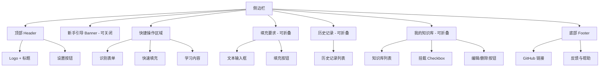

#### 3.2.2 核心功能

**快捷操作（3个按钮）：**
1. **识别表单**
   - 图标：表格 SVG
   - 功能：扫描页面表单字段，AI 识别字段类型和用途
   - 视觉反馈：
     - 扫描波纹从左到右扫过表单
     - 输入框逐个橙色脉冲高亮（识别中）
     - 识别完成后，输入框显示淡蓝色背景（已识别状态）
   
2. **快速填充**
   - 图标：魔法棒 SVG
   - 功能：基于预设的字段映射关系快速填充
   - 映射关系说明：
     - 用户在设置页面预先配置好「字段名 → 填充内容」的映射
     - 例如："姓名" → "张三"，"邮箱" → "zhangsan@example.com"
     - AI 自动识别表单字段，匹配对应的映射关系
   - 适用场景：重复填写相同类型的表单（如注册表单、问卷调查）
   - 优势：无需 AI 生成，速度快，内容稳定
   
3. **学习内容**
   - 图标：书本 SVG
   - 功能：学习当前表单已填写内容，用于快速填充和智能填充
   - 流程：
     - 抓取当前页面所有已填写的表单内容
     - 提取内容值与字段类型的映射关系
     - 示例：识别到"张明"填写在"姓名"字段 → 保存为 `张明 → ["姓名"]`
     - 保存映射关系到字段映射配置（用于快速填充）
     - AI 自动生成 Summary（不显示给用户）
     - 保存为新的知识库档案（用于智能填充）
   - 学习结果提示："已学习 X 个字段映射，并保存到知识库"

**填充要求（手风琴面板）：**
- 功能：智能填充（AI 生成内容）
- 多行文本输入框
- placeholder："例如：重点突出我的技术能力，语气要专业..."
- 填充按钮（主色调）
- 与快速填充的区别：
  - **智能填充**：用户可输入自定义要求，AI 根据要求和知识库生成内容
  - **快速填充**：直接使用预设映射关系，无需 AI 生成

**历史记录（手风琴面板）：**
- 显示最近的填充要求
- 点击可快速应用

**我的知识库（手风琴面板）：**
- 知识库列表
- 每项包含：
  - Checkbox（挂载/卸载）
  - 名称 + 描述
  - 编辑/删除按钮

#### 3.2.3 设计规范
- **卡片圆角**：12px
- **按钮圆角**：8px/10px
- **间距**：16px（卡片之间）、12px（元素之间）
- **阴影**：`var(--shadow-sm)`
- **过渡动画**：0.2s ease

---

### 3.3 设置页面（Settings）

#### 3.3.1 页面结构
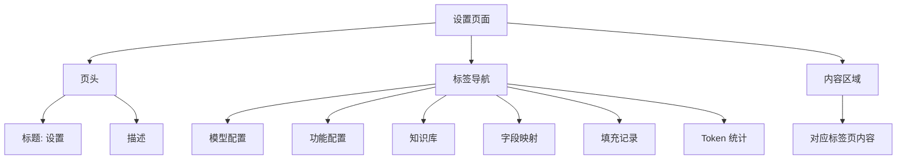

#### 3.3.2 标签页详细设计

**Tab 1: 模型配置**
- 默认模型选择
  - 模型提供商下拉框：OpenAI / 通义千问 / 智谱AI / DeepSeek / 硅基流动 / 火山引擎 / Ollama (本地)
  - 模型名称下拉框（级联）
- API Key 输入框

**Tab 2: 功能配置**
- 全局设置卡片
  - 一键应用模型到所有功能
  - 提供商 + 模型级联选择
  - 应用按钮
  
- 功能列表（每个功能独立卡片）
  - 功能名称
  - 提供商 + 模型级联选择
  - 提示词编辑（Textarea，等宽字体）
  - 重置 / 保存按钮

**功能列表：**
1. 表单填充
2. 翻译功能
3. AI 学习

**Tab 3: 知识库**
- 知识库列表
  - 每项显示：图标、名称、描述、更新时间
  - 操作按钮：编辑、删除
- 新建按钮
- 点击编辑弹出模态框
  - 档案名称
  - 档案内容（大文本框，纯文本）
  - 取消 / 保存按钮

**Tab 4: 字段映射**
- 功能说明：配置内容值与表单字段类型的映射关系，用于快速填充
- 映射列表
  - 每项显示：
    - 内容值（如：张明、zhangming@example.com、13800138000）
    - 字段类型（如：姓名 / Name、邮箱 / Email、手机号 / Phone）
    - 操作：编辑、删除
- 新增映射按钮
- 编辑/新增弹出模态框：
  - 内容值输入框（你要填充的实际内容）
  - 字段类型输入框（支持多个别名，用 / 分隔）
  - 说明文字（映射逻辑和匹配规则）
  - 保存 / 取消按钮
- 导入/导出功能（JSON 格式）

**映射逻辑：内容 → 字段类型**
- 例如：`张明` → `姓名 / 真实姓名 / 用户名 / Name`
- 当表单中出现"姓名"、"真实姓名"、"用户名"或"Name"字段时
- 自动填充"张明"这个内容值

**匹配规则说明：**
- 字段类型支持多个别名（如："姓名 / Name"可匹配"真实姓名"、"用户姓名"、"Full Name"）
- 支持字段类型匹配（如：email、tel、url）
- 优先级：精确匹配 > 模糊匹配 > 类型匹配
- 支持中英文混合

**Tab 5: 填充记录**
- 记录列表（最大高度可滚动）
  - 网站域名 + 图标
  - 时间
  - 填充字段列表（可展开）
  - 操作：查看详情、保存为知识、删除

**Tab 6: Token 统计**
- 统计卡片（3个）
  - 今日消耗
  - 本月消耗
  - 预估费用
  
- 使用明细表格
  - 列：模型、输入/输出、消耗（带进度条）、费用
  
- 模型报价参考表格（完整59个模型）
  - 列：厂商、模型名称、输入单价、输出单价、核心定位

#### 3.3.3 响应式设计

**中等屏幕（≤768px）：**
- 表单网格改为单列
- 统计卡片改为单列
- 导航标签支持横向滚动

**窄屏（≤480px）：**
- 最小化内边距
- 缩小字体
- 表格横向滚动
- 模态框底部按钮垂直排列

---

### 3.4 输入框交互（Input Interactions）

#### 3.4.1 交互场景

**场景 1: 空输入框**
- 点击后显示操作按钮（在输入框上方，紧贴）
- 操作按钮：
  - 填充按钮（下拉）：
    - 快速填充（基于预设映射）
    - 智能填充（AI 生成，可输入要求）
    - 填充整个表单
  - 翻译按钮（下拉）：支持多语言
- 按钮样式：
  - 小尺寸（padding: 6px 10px, font-size: 12px）
  - 圆角：6px
  - 阴影：`0 2px 8px rgba(0,0,0,0.08)`

**场景 2: 有缓存值**
- 输入框样式：
  - 背景色：`rgba(31, 135, 252, 0.08)`
  - 边框色：`#1f87fc`
  - Placeholder 颜色：`#1f87fc`（非斜体，无灯泡图标）
- 点击后显示：
  - 缓存确认按钮（绿色，带 Tooltip）
  - 翻译按钮
  - 填充按钮
- 填充完成后：
  - 绿色边框 + 浅绿色背景
  - 缩放动画（1.0 → 1.02 → 1.0）
  - Toast 提示："已填充缓存值"
  - 0.5秒后恢复蓝色状态

**场景 3: 已有内容**
- 点击填充按钮弹出页面内确认对话框
- 对话框内容：
  - 标题："当前输入框已有内容"
  - 说明文字
  - 确定（修改）/ 取消（替换）按钮
- 不使用 alert/msgbox

**场景 4: 多行文本框**
- 支持重新生成功能
- 重新生成栏（可展开）：
  - 输入框："输入你的要求，例如：更专业、更简洁..."
  - 取消 / 重新生成按钮

**场景 5: 输入框动效**
- 提供演示按钮触发各种动效
- scanning / filling / filled / error

#### 3.4.2 操作按钮定位
- 位置：`bottom: 100%; right: 0; margin-bottom: 4px;`
- 显示控制：通过 `.input-wrapper.active` 类
- 激活条件：
  - 输入框 focus
  - 输入框 hover
  - 确认对话框打开时

#### 3.4.3 Toast 系统
- 位置：顶部居中
- 动画：滑入滑出
- 显示时长：2秒
- 支持类型：success / info / error

---

## 四、交互流程

### 4.1 首次使用流程
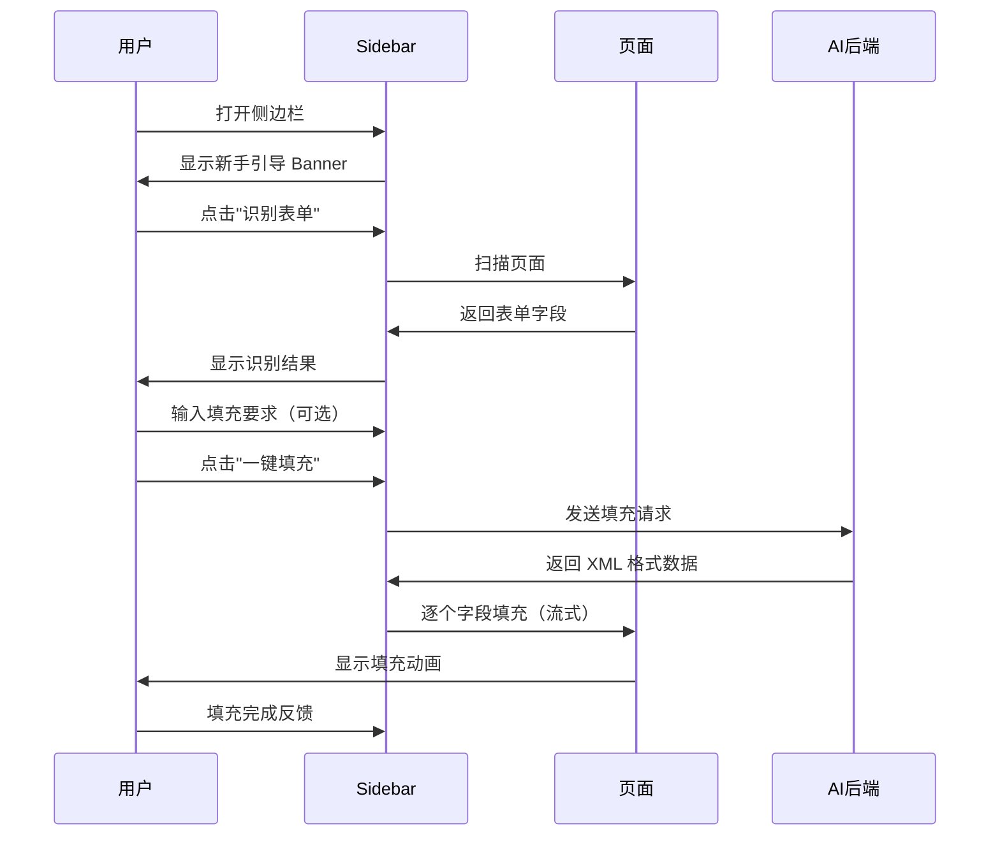

### 4.2 有缓存值填充流程
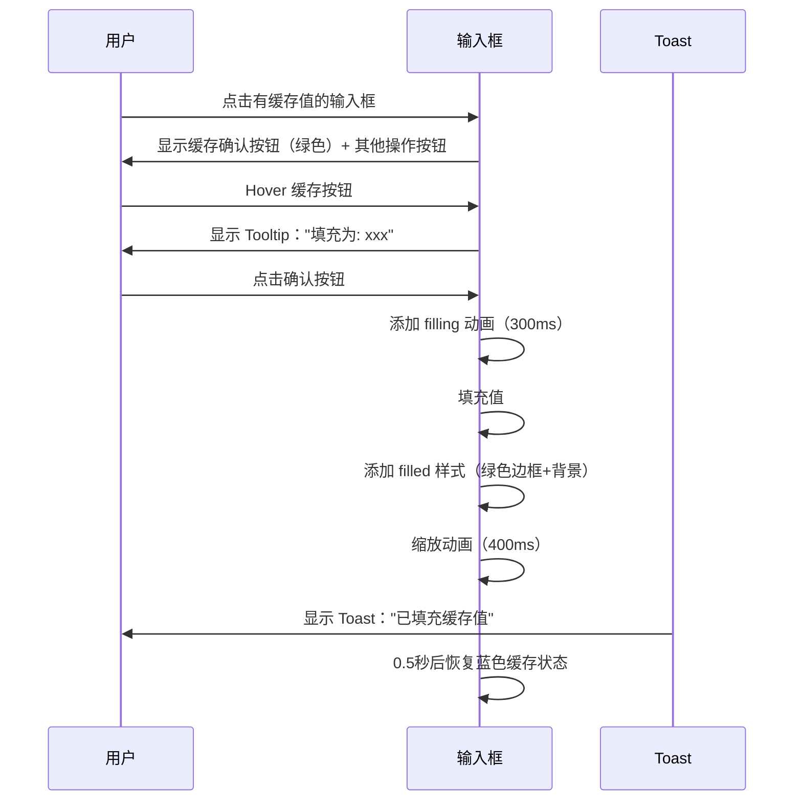

### 4.3 快速填充流程（基于字段映射）
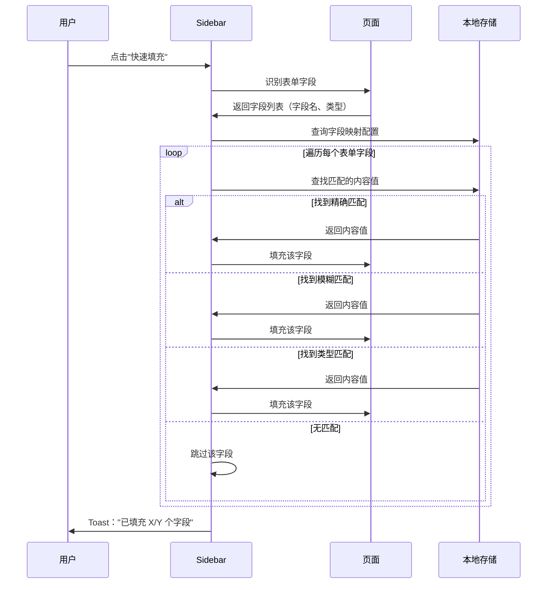

**映射示例：**
```javascript
{
  "张明": ["姓名", "真实姓名", "用户名", "Name", "Full Name"],
  "zhangming@example.com": ["邮箱", "Email", "电子邮件", "E-mail"],
  "13800138000": ["手机号", "电话", "联系方式", "Phone", "Mobile"],
  "金山办公": ["公司", "单位", "工作单位", "Company"]
}
```

**匹配逻辑：**
1. 表单字段：`<input placeholder="请输入您的姓名">`
2. AI 识别：字段类型为"姓名"
3. 查询映射：找到"张明" → ["姓名", ...]
4. 自动填充："张明"

### 4.4 智能填充流程（AI 生成）
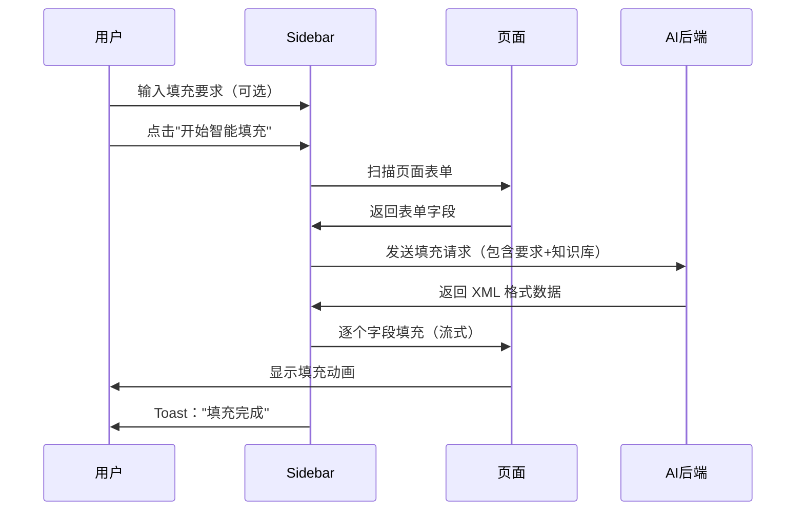

### 4.5 字段映射管理流程
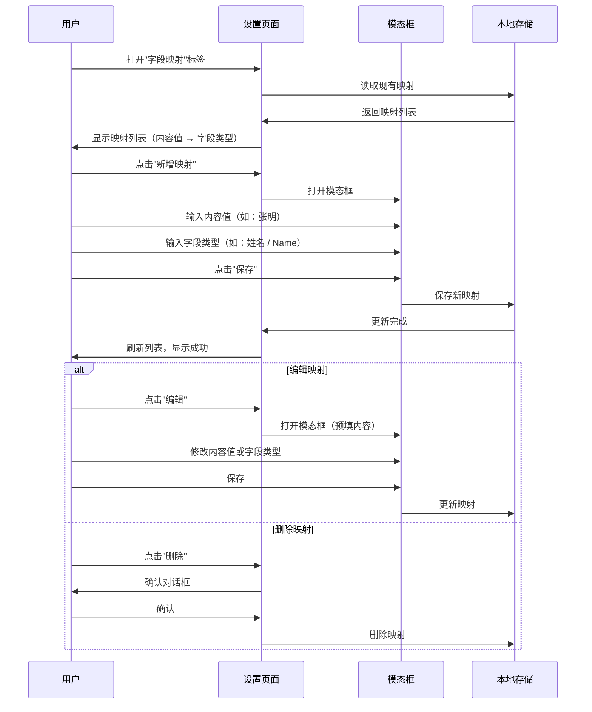

**数据结构示例：**
```json
{
  "mappings": [
    {
      "id": "map_001",
      "contentValue": "张明",
      "fieldTypes": ["姓名", "真实姓名", "用户名", "Name", "Full Name"],
      "createdAt": "2025-01-31"
    },
    {
      "id": "map_002",
      "contentValue": "zhangming@example.com",
      "fieldTypes": ["邮箱", "Email", "电子邮件", "E-mail"],
      "createdAt": "2025-01-31"
    }
  ]
}
```

### 4.6 已有内容填充流程
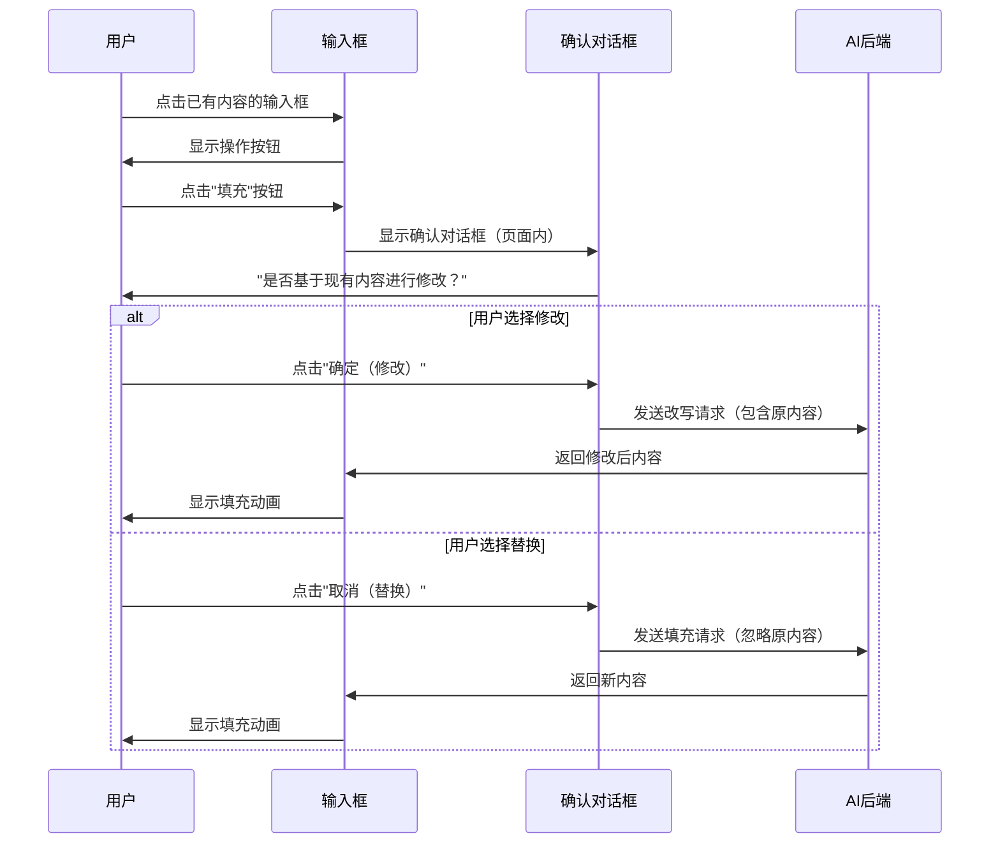

### 4.7 学习内容流程
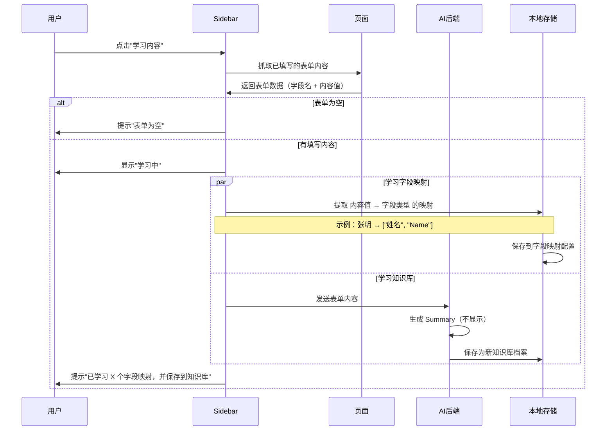

**学习内容的双重作用：**

1. **字段映射**（内容 → 字段类型）：用于快速填充
   - 提取逻辑：
     - 字段：`<input name="realName" placeholder="姓名">`，内容：`张明`
     - 保存映射：`张明` → `["姓名", "realName"]`
   - 保存位置：字段映射配置
   - 使用场景：快速填充相同类型的表单
   - 示例：
     ```javascript
     {
       "张明": ["姓名", "真实姓名", "Name"],
       "zhangming@example.com": ["邮箱", "Email"],
       "13800138000": ["手机号", "电话", "Phone"]
     }
     ```

2. **知识库**：用于智能填充
   - 示例：完整的个人信息、工作经历等
   - 保存位置：知识库档案
   - 使用场景：AI 根据要求生成个性化内容

### 4.8 知识库管理流程
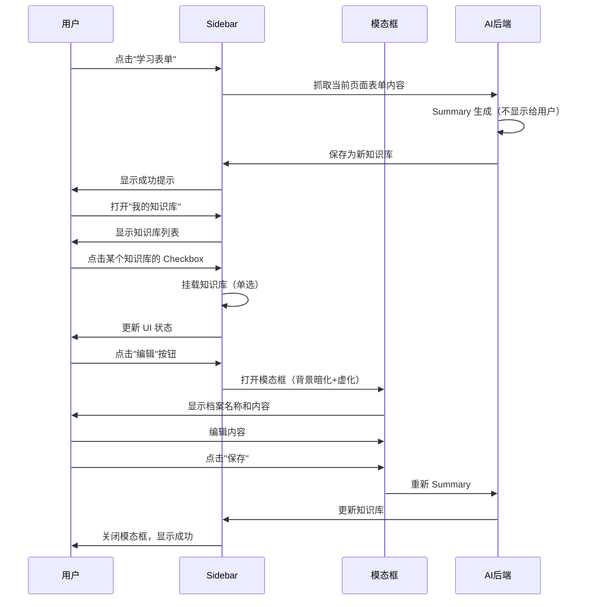

### 4.9 智能填充决策流程（基于知识库）
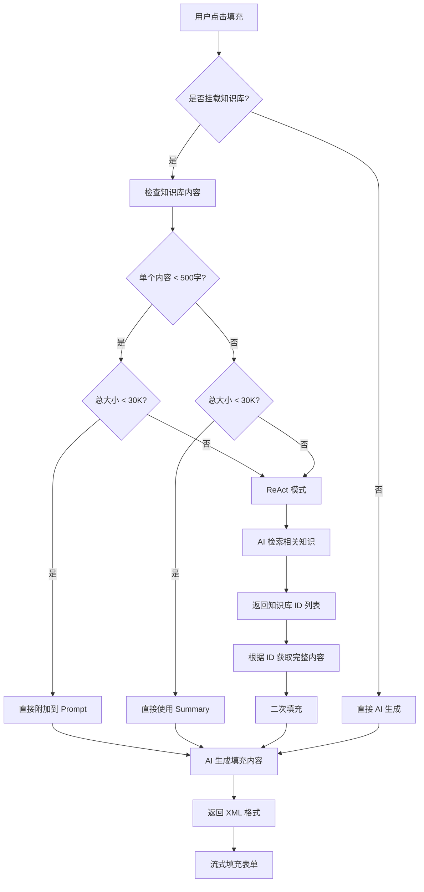

**决策规则详解：**

1. **直接附加模式（< 500字 且 总计 < 30K）**
   ```javascript
   if (knowledgeItem.content.length < 500 && totalSize < 30000) {
       // 直接将知识库内容添加到 Prompt
       prompt += `\n\n参考信息：\n${knowledgeItem.content}`;
   }
   ```
   - **优点**：简单高效，一次性完成
   - **适用场景**：知识库内容简短，不会超出 token 限制

2. **Summary 模式（内容 ≥ 500字 但 总计 < 30K）**
   ```javascript
   if (knowledgeItem.content.length >= 500 && totalSize < 30000) {
       // 使用预生成的 Summary
       prompt += `\n\n参考信息摘要：\n${knowledgeItem.summary}`;
   }
   ```
   - **优点**：压缩内容，节省 token
   - **适用场景**：知识库内容较长但未超限

3. **ReAct 模式（总计 ≥ 30K）**
   ```javascript
   if (totalSize >= 30000) {
       // 第一步：AI 检索
       const relevantIds = await ai.retrieveRelevant({
           query: userPrompt,
           knowledgeBase: summaryList
       });
       
       // 第二步：获取完整内容
       const fullContent = relevantIds.map(id => 
           getKnowledgeById(id)
       );
       
       // 第三步：二次填充
       const result = await ai.fill({
           prompt: userPrompt,
           context: fullContent
       });
   }
   ```
   - **流程**：
     1. AI 接收所有 Summary 列表
     2. AI 返回相关知识库 ID 数组
     3. 系统根据 ID 获取完整内容
     4. AI 基于完整内容生成填充结果
   - **优点**：智能筛选，避免 token 溢出
   - **适用场景**：知识库内容很多或很长

---

## 五、技术实现细节

### 5.1 暗黑模式实现
```css
/* 自动检测系统暗黑模式 */
@media (prefers-color-scheme: dark) {
    :root {
        --primary: #4d9fff;
        --text-primary: #e8eaed;
        --text-secondary: #9aa0a6;
        --text-tertiary: #80868b;
        --border: #3c4043;
        --bg-primary: #202124;
        --bg-secondary: #292a2d;
        --bg-hover: #35363a;
        --success: #35a557;
    }
}
```

### 5.2 手风琴动画实现
```css
.collapsible-content {
    max-height: 0;
    overflow: hidden;
    padding: 0 16px;
    opacity: 0;
    transition: max-height 0.3s ease, 
                padding 0.3s ease, 
                opacity 0.3s ease;
}

.collapsible-content.active {
    max-height: 800px;
    padding: 16px;
    opacity: 1;
}
```

### 5.3 输入框激活控制
```javascript
// 监听 focus 事件
input.addEventListener('focus', function() {
    const wrapper = this.closest('.input-wrapper');
    wrapper.classList.add('active');
    
    // 如果有缓存，显示缓存按钮
    if (this.classList.contains('has-cache')) {
        const cacheBtn = wrapper.querySelector('.cache-confirm-btn');
        cacheBtn.style.display = 'flex';
    }
});

// 监听 blur 事件（延迟取消激活）
input.addEventListener('blur', function() {
    const wrapper = this.closest('.input-wrapper');
    setTimeout(() => {
        if (!wrapper.matches(':hover') && 
            !wrapper.querySelector('.confirm-dialog.active')) {
            wrapper.classList.remove('active');
        }
    }, 200);
});
```

### 5.4 Toast 实现
```javascript
function showToast(message, type = 'success') {
    const toast = document.getElementById('toast');
    const messageEl = document.getElementById('toast-message');
    
    messageEl.textContent = message;
    toast.className = 'toast ' + type;
    
    setTimeout(() => {
        toast.classList.add('show');
    }, 10);
    
    setTimeout(() => {
        toast.classList.remove('show');
    }, 2000);
}
```

---

## 六、核心算法与逻辑

### 6.1 快速填充算法（基于字段映射）

#### 6.1.1 映射数据结构
```javascript
{
  mappings: [
    {
      id: "map_001",
      contentValue: "张明",                    // 要填充的内容
      fieldTypes: [                           // 可匹配的字段类型
        "姓名", "真实姓名", "用户名",          // 中文别名
        "Name", "Full Name", "Username"       // 英文别名
      ],
      createdAt: "2025-01-31",
      updatedAt: "2025-01-31"
    },
    {
      id: "map_002",
      contentValue: "zhangming@example.com",
      fieldTypes: ["邮箱", "Email", "电子邮件", "E-mail"],
      createdAt: "2025-01-31"
    }
  ]
}
```

#### 6.1.2 快速填充算法伪代码
```javascript
async function quickFillForm(formFields) {
    // 1. 获取所有映射配置
    const mappings = await loadMappings();
    
    // 2. 识别表单字段
    const results = [];
    let filledCount = 0;
    let skippedCount = 0;
    
    for (const field of formFields) {
        // 检查字段是否已有内容
        if (field.value && field.value.trim() !== '') {
            skippedCount++;
            continue; // 跳过已有内容的字段
        }
        
        const fieldName = field.name || field.placeholder || field.label;
        const fieldType = field.type; // email, tel, url 等
        
        // 3. 查找匹配的映射
        const match = findBestMatch(fieldName, fieldType, mappings);
        
        if (match) {
            results.push({
                field: field,
                value: match.contentValue,
                matchType: match.type // 'exact' | 'fuzzy' | 'type'
            });
            filledCount++;
        }
    }
    
    // 4. 填充字段
    for (const result of results) {
        await fillField(result.field, result.value);
    }
    
    // 5. 返回填充结果
    return {
        total: formFields.length,
        filled: filledCount,
        skipped: skippedCount,
        unfilled: formFields.length - filledCount - skippedCount
    };
}

// 查找最佳匹配
function findBestMatch(fieldName, fieldType, mappings) {
    let bestMatch = null;
    let bestScore = 0;
    
    for (const mapping of mappings) {
        for (const type of mapping.fieldTypes) {
            // 精确匹配（优先级最高）
            if (fieldName === type) {
                return { ...mapping, type: 'exact', score: 100 };
            }
            
            // 模糊匹配（包含关系）
            if (fieldName.includes(type) || type.includes(fieldName)) {
                const score = 80;
                if (score > bestScore) {
                    bestScore = score;
                    bestMatch = { ...mapping, type: 'fuzzy', score };
                }
            }
        }
        
        // 类型匹配（如 email、tel）
        if (fieldType && mapping.fieldTypes.some(t => 
            t.toLowerCase() === fieldType.toLowerCase()
        )) {
            const score = 60;
            if (score > bestScore) {
                bestScore = score;
                bestMatch = { ...mapping, type: 'type', score };
            }
        }
    }
    
    return bestMatch;
}
```

#### 6.1.3 匹配示例

**示例 1：精确匹配**
- 表单字段：`<input placeholder="姓名">`
- 映射配置：`张明` → `["姓名", "Name"]`
- 匹配结果：精确匹配"姓名" → 填充"张明"

**示例 2：模糊匹配**
- 表单字段：`<input placeholder="请输入您的真实姓名">`
- 映射配置：`张明` → `["姓名", "真实姓名", "Name"]`
- 匹配结果：模糊匹配"真实姓名" → 填充"张明"

**示例 3：类型匹配**
- 表单字段：`<input type="email" placeholder="请输入邮箱">`
- 映射配置：`zhangming@example.com` → `["邮箱", "Email"]`
- 匹配结果：类型匹配（email + "Email"） → 填充"zhangming@example.com"

**示例 4：中英文混合**
- 表单字段：`<input placeholder="Company Name">`
- 映射配置：`金山办公` → `["公司", "Company", "单位"]`
- 匹配结果：模糊匹配"Company" → 填充"金山办公"

### 6.2 智能填充决策算法（基于知识库）

#### 6.2.1 知识库数据结构
```javascript
{
  id: "kb_001",
  name: "个人简历",
  content: "原始文本内容...",  // 用户编辑的完整内容
  summary: "AI 生成的摘要...", // 自动生成，不显示给用户
  contentLength: 1250,         // 字符数
  createdAt: "2025-01-31",
  updatedAt: "2025-01-31",
  mounted: true                // 是否挂载
}
```

#### 6.2.2 填充决策伪代码
```javascript
async function intelligentFill(userPrompt, formFields) {
    // 1. 获取挂载的知识库
    const mountedKB = getKnowledgeBases().filter(kb => kb.mounted);
    
    if (mountedKB.length === 0) {
        // 无知识库，直接 AI 生成
        return await ai.fill({ prompt: userPrompt, fields: formFields });
    }
    
    // 2. 计算总大小
    let totalSize = 0;
    let smallContents = [];
    let summaryList = [];
    
    for (const kb of mountedKB) {
        totalSize += kb.content.length;
        
        if (kb.contentLength < 500) {
            smallContents.push(kb);
        }
        
        summaryList.push({
            id: kb.id,
            name: kb.name,
            summary: kb.summary
        });
    }
    
    // 3. 决策逻辑
    if (totalSize < 30000) {
        // 3.1 直接附加模式
        let contextPrompt = userPrompt;
        
        for (const kb of smallContents) {
            contextPrompt += `\n\n## ${kb.name}\n${kb.content}`;
        }
        
        for (const kb of mountedKB) {
            if (!smallContents.includes(kb)) {
                contextPrompt += `\n\n## ${kb.name} (摘要)\n${kb.summary}`;
            }
        }
        
        return await ai.fill({
            prompt: contextPrompt,
            fields: formFields
        });
    } else {
        // 3.2 ReAct 模式（两阶段填充）
        
        // 第一阶段：检索相关知识
        const retrievalPrompt = `
用户需求：${userPrompt}
表单字段：${JSON.stringify(formFields)}
可用知识库摘要：${JSON.stringify(summaryList)}

请返回最相关的知识库 ID 列表（JSON 数组格式）：
        `;
        
        const relevantIds = await ai.retrieve(retrievalPrompt);
        // 返回示例：["kb_001", "kb_003"]
        
        // 第二阶段：基于完整内容填充
        let fullContext = userPrompt;
        for (const id of relevantIds) {
            const kb = mountedKB.find(k => k.id === id);
            if (kb) {
                fullContext += `\n\n## ${kb.name}\n${kb.content}`;
            }
        }
        
        return await ai.fill({
            prompt: fullContext,
            fields: formFields
        });
    }
}
```

#### 6.2.3 阈值说明
- **500 字**：单个知识库内容长度阈值
  - 小于 500 字认为是"简短内容"，可以直接附加
  - 大于等于 500 字使用 Summary
  
- **30K 字符**：总内容长度阈值
  - 约 30,000 tokens（按中文 1 字 ≈ 1 token 估算）
  - 超过此阈值需要使用 ReAct 模式避免溢出
  - 预留一定 buffer 给 AI 响应和系统 prompt

#### 6.2.4 优化策略
1. **缓存 Summary**
   - Summary 在保存时生成，不在填充时生成
   - 减少填充延迟
   
2. **批量检索**
   - ReAct 模式第一阶段一次性返回所有相关 ID
   - 避免多次往返
   
3. **渐进式加载**
   - 优先使用小内容
   - 大内容优先使用 Summary
   - 最后才使用 ReAct

---

## 七、测试用例

### 7.1 动效测试
| 测试项 | 输入 | 预期输出 |
|--------|------|----------|
| 扫描动效 | 点击"扫描动效"按钮 | 输入框显示黄色脉冲动画1.5秒 |
| 填充动效 | 点击"填充动效"按钮 | 输入框显示渐变边框动画0.8秒 |
| 成功动效 | 点击"成功动效"按钮 | 输入框显示绿色边框+缩放动画0.5秒 |
| 错误动效 | 点击"错误动效"按钮 | 输入框显示红色边框+抖动动画0.5秒 |

### 7.2 交互测试
| 测试项 | 操作 | 预期结果 |
|--------|------|----------|
| 空输入框激活 | 点击空输入框 | 显示操作按钮，位置在输入框上方4px |
| 有缓存值点击 | 点击有缓存值输入框 | 显示绿色确认按钮和其他操作按钮 |
| 缓存值填充 | 点击确认按钮 | 执行填充动画，显示Toast，0.5秒后恢复蓝色 |
| 已有内容填充 | 点击已有内容输入框的填充按钮 | 弹出页面内确认对话框 |
| 手风琴折叠 | 点击折叠面板标题 | 平滑展开/收起，带透明度和高度动画 |

### 7.3 响应式测试
| 屏幕宽度 | 布局变化 |
|----------|----------|
| ≥769px | 正常桌面布局 |
| ≤768px | 表单单列，导航横向滚动 |
| ≤480px | 最小化间距，表格横向滚动，模态框全宽 |

### 7.4 暗黑模式测试
| 测试项 | 浅色模式 | 暗色模式 |
|--------|----------|----------|
| 主色调 | `#1f87fc` | `#4d9fff` |
| 成功色 | `#2d8f47` | `#35a557` |
| 背景色 | `#ffffff` | `#202124` |
| 文本色 | `#202124` | `#e8eaed` |
| 有缓存背景 | `rgba(31,135,252,0.08)` | `rgba(77,159,255,0.15)` |

### 7.5 智能填充决策测试

| 场景 | 知识库配置 | 预期行为 |
|------|------------|----------|
| 无知识库 | 未挂载任何知识库 | 直接 AI 生成，不使用知识库 |
| 简短内容 | 2个知识库，各300字，总600字 | 直接附加两个完整内容到 Prompt |
| 混合内容 | 1个200字 + 1个800字，总1000字 | 200字完整附加，800字使用 Summary |
| 总量临界 | 多个知识库，总计29K字 | 小内容完整附加，大内容用 Summary |
| 超出限制 | 5个知识库，总计50K字 | ReAct 模式：先检索相关ID，再二次填充 |
| ReAct 筛选 | 总50K，用户需求只涉及2个 | AI 返回2个相关ID，仅用这2个完整内容 |

---

## 八、待实现功能

### 8.1 Phase 1（已完成）
- ✅ 动效 Playground 页面
- ✅ 输入框状态动效（scanning/filling/filled/error）
- ✅ 气泡提示动效
- ✅ Sidebar 界面重构
- ✅ 设置页面重构
- ✅ 输入框交互（空/缓存/已有内容）
- ✅ 暗黑模式支持
- ✅ 响应式布局

### 8.2 Phase 2（待开发）
- ⏳ 表单识别功能实现
- ⏳ AI 填充 API 集成
- ⏳ 知识库本地存储
  - ⏳ 知识库内容存储（纯文本）
  - ⏳ Summary 自动生成和缓存
  - ⏳ 智能填充决策引擎（< 500字 / Summary / ReAct）
- ⏳ Token 统计功能
- ⏳ 填充记录持久化
- ⏳ 导出/导入知识库

### 8.3 Phase 3（规划中）
- 📋 多语言支持
- 📋 自定义快捷键
- 📋 知识库同步（云端）
- 📋 团队协作功能

---

## 九、文件结构

```
playground/
├── index.html                          # Playground 导航页
├── animation-playground.html           # 动效演示页（参考）
├── v2-sidebar-redesign.html           # 侧边栏 V3 设计
├── v2-settings-redesign.html          # 设置页 V3 设计
├── v2-input-interactions-redesign.html # 输入框交互 V3 设计
├── v2-sidebar.html                     # 侧边栏 V2 旧版（保留参考）
├── v2-settings.html                    # 设置页 V2 旧版（保留参考）
├── v2-input-interactions.html          # 输入框交互 V2 旧版（保留参考）
└── PRD.md                              # 本文档
```

---

## 十、更新日志

### 2025-01-31
- 创建 PRD.md
- 完成 V3 Redesign 所有页面
- 修复按钮位置、层级、配色等问题
- 优化窄屏响应式布局
- 添加手风琴平滑动画
- 优化快捷操作按钮 hover 效果
- 完善有缓存值填充完成状态
- **新增第六章：核心算法与逻辑**
  - 智能填充决策算法
  - 知识库数据结构
  - 三种填充模式（直接附加/Summary/ReAct）
  - 阈值说明（500字/30K）
  - 完整伪代码实现
- 新增智能填充决策测试用例

---

## 十一、联系方式

- **开发者**：洛小山
- **GitHub**：https://github.com/itshen/
- **开源协议**：MIT License
- **版权信息**：Copyright (c) 2025 Miyang Tech (Zhuhai Hengqin) Co., Ltd.
