# AI Former 浏览器插件 - 交互动效与界面设计 PRD

## 一、项目概述

### 1.1 项目背景
AI Former 是一个智能表单填充浏览器插件，需要优化其交互动效、侧边栏界面、设置页面和输入框交互体验。

### 1.2 项目目标
- 设计并实现完整的输入框交互动效系统
- 重新设计侧边栏（Sidebar）界面，提供更简洁的用户体验
- 重新设计设置页面，支持多种配置项
- 创建动效 Playground 用于调试和演示
- **支持多场景应用**：表单填充、BBS 回复等
- 确保所有界面支持暗黑模式和响应式布局

### 1.3 设计原则
- **简洁优雅**：避免过度设计，采用 SaaS 风格
- **用户友好**：交互流畅，反馈及时
- **系统跟随**：自动适配系统的暗黑模式
- **响应式**：支持不同屏幕尺寸，特别是浏览器侧边栏宽度
- **无障碍**：符合 WCAG 规范

---

## 二、技术栈与约束

### 2.1 技术选型
- **前端框架**：纯 HTML + CSS（禁止使用 Vue/React/Alpine.js）
- **样式方案**：CSS Variables + Media Queries
- **图标系统**：Lucide Icons（本地文件）
- **AI 模型**：google/gemini-3-flash-preview（关闭 Reasoning）
- **API Key 管理**：本地存储

**图标集成方式**：
```html
<!-- 本地引入（已下载到 playground/lucide.min.js） -->
<script src="lucide.min.js"></script>

<!-- 使用方式 -->
<i data-lucide="sparkles"></i>  <!-- AI 填充 -->
<i data-lucide="globe"></i>     <!-- 翻译 -->
<i data-lucide="check"></i>     <!-- 确认 -->
<i data-lucide="refresh-cw"></i> <!-- 重填表单 -->
<i data-lucide="chevron-down"></i> <!-- 折叠 -->

<!-- JavaScript 初始化（在 DOMContentLoaded 或文件末尾） -->
<script>
  if (typeof lucide !== 'undefined') {
      lucide.createIcons();
  }
</script>
```

**常用图标列表**：
- `sparkles` - AI 填充/魔法
- `languages` - 翻译（替换了 globe）
- `check` - 确认
- `list-restart` - 重填整个表单（替换了 refresh-cw）
- `chevron-down` - 下拉/折叠
- `chevron-left` - 返回
- `x` - 关闭
- `settings` - 设置
- `scan-text` - 扫描表单（替换了 scan-line）
- `book-open` - 学习内容/知识库
- `github` - GitHub（14px）
- `user` - 用户/头像
- `external-link` - 外部链接
- `folder` - 文件夹
- `arrow-right` - 右箭头

**图标大小规范**：
- 主按钮（.btn-primary）图标：16px × 16px
- GitHub 链接图标：14px × 14px
- 其他图标：默认大小（由 Lucide 控制）

### 2.2 配色规范
- **主色调**：蓝色 `#1f87fc`（填充按钮、有缓存值边框）
- **成功色**：绿色 `#2d8f47`（确认按钮、填充完成）
- **文本色**：`--text-primary`, `--text-secondary`, `--text-tertiary`
- **背景色**：`--bg-primary`, `--bg-secondary`, `--bg-hover`
- **边框色**：`--border`

### 2.3 设计约束
- ❌ 禁止使用色块左侧竖线设计
- ❌ 禁止使用 emoji 作为按钮图标
- ❌ 禁止使用蓝紫色渐变背景
- ❌ 禁止使用超大按钮
- ✅ 必须使用 SVG 图标
- ✅ 必须支持暗黑模式
- ✅ 必须使用 mingcute 图标风格

---

## 三、应用场景

### 3.1 场景一：注册表单填充

**场景描述**：
用户需要在各类网站注册账号，填写个人信息表单。

**核心功能**：
- 识别表单字段（姓名、邮箱、手机号、地址等）
- 快速填充：使用预设的个人信息映射
- 智能填充：根据知识库生成个性化内容
- 引用区域：挂载个人档案知识库

**用户流程**：
1. 打开注册页面，侧边栏自动识别表单
2. 点击"快速填充"，基础信息自动填入
3. 对于"个人简介"等字段，输入填充要求："突出技术能力"
4. 点击"开始智能填充"，AI 生成个性化简介

### 3.2 场景二：BBS 论坛回复

**场景描述**：
用户在论坛、社区浏览帖子，需要回复内容。

**Playground 文件**：`v2-bbs-reply.html`

**页面布局**：
```
┌─────────────────┬────────────────────────────────┐
│   侧边栏        │   主内容区（论坛帖子页面）      │
│ ┌─────────────┐ │ ┌────────────────────────────┐ │
│ │填充要求面板  │ │ │ 标题：如何学习前端开发？    │ │
│ │             │ │ ├────────────────────────────┤ │
│ │ 📎 引用内容 │ │ │ #1楼 @楼主                  │ │
│ │ [空状态]    │ │ │ 我是零基础小白，想学前端... │ │
│ │             │ │ │ [可划词]                   │ │
│ │ 填充要求:   │ │ ├────────────────────────────┤ │
│ │ [输入框]    │ │ │ #2楼 @张三                  │ │
│ │             │ │ │ 建议从 HTML/CSS 开始...     │ │
│ │ [开始填充]  │ │ │ [可划词]                   │ │
│ └─────────────┘ │ ├────────────────────────────┤ │
│                 │ │ 我的回复：                  │ │
│                 │ │ ┌──────────────────────────┐ │
│                 │ │ │ [多行文本输入框]         │ │
│                 │ │ │                          │ │
│                 │ │ └──────────────────────────┘ │
│                 │ │ [发布回复]                  │ │
│                 │ └────────────────────────────┘ │
└─────────────────┴────────────────────────────────┘
```

**核心功能**：

1. **划词引用**：
   - 选中楼层内容 → 出现浮动按钮"➕ 添加到引用"
   - 点击后内容添加到侧边栏引用区域
   - 记录来源信息（楼层号、用户名）

2. **智能回复**：
   - 引用区域显示被引用的内容
   - 填充要求输入框："礼貌回复，提供建设性意见"
   - AI 根据引用内容和要求生成回复

**用户流程**：
1. 阅读主楼内容，划词添加关键内容到引用
2. 浏览其他楼层，划词添加需要回应的观点
3. 在填充要求中输入回复要求
4. 点击"开始智能填充"，AI 生成针对性回复，填充到"我的回复"框

**引用区域示例**：
```
📎 引用内容 (2)
┌─────────────────────────────────────┐
│ 🔗 来自 #1楼 @楼主                    │
│ "我是零基础小白，想学前端开发"       │ [×]
├─────────────────────────────────────┤
│ 🔗 来自 #2楼 @张三                    │
│ "建议从 HTML/CSS 开始，循序渐进"    │ [×]
└─────────────────────────────────────┘
```

**填充要求示例**：
```
礼貌回复楼主和张三的观点，鼓励楼主坚持学习，
同意张三的建议，补充推荐一些学习资源。
语气友好、鼓励性。
```

**技术实现要点**：

1. **划词监听**：
```javascript
// 监听文本选择
document.addEventListener('mouseup', function(e) {
    const selection = window.getSelection();
    const selectedText = selection.toString().trim();
    
    if (selectedText.length > 0) {
        // 获取选区位置
        const range = selection.getRangeAt(0);
        const rect = range.getBoundingClientRect();
        
        // 显示浮动按钮
        showAddReferenceButton(rect, selectedText);
    }
});
```

2. **添加到引用区域**：
```javascript
function addToReference(text, source) {
    const referenceArea = document.getElementById('referenceArea');
    const referenceCard = createReferenceCard({
        text: text,
        source: source, // { type: 'bbs', floor: 1, username: '楼主' }
        timestamp: Date.now()
    });
    referenceArea.appendChild(referenceCard);
}
```

3. **AI 填充时携带引用**：
```javascript
function fillBBSReply() {
    const references = getAllReferences(); // 获取所有引用
    const requirement = getRequirement(); // 获取填充要求
    
    const prompt = `
引用内容：
${references.map(r => `- ${r.source.username}说："${r.text}"`).join('\n')}

用户要求：
${requirement}

请生成一个合适的回复内容。
    `;
    
    // 调用 AI API
    callAI(prompt).then(reply => {
        fillTextarea(reply);
    });
}
```

**Demo 数据示例**：

**主楼内容**：
```
标题：前端新手如何学习 React？

我是刚学完 HTML/CSS/JS 基础的新手，想开始学习 React。
看了很多教程，感觉知识点很零散，不知道从哪里开始。
大家有什么好的学习路线推荐吗？
```

**回复楼层**：
```
#2楼 @张三：
建议先把 JavaScript 基础打牢，特别是 ES6+ 语法。
然后跟着 React 官方文档一步步学，很清晰。

#3楼 @李四：
我当时是看视频教程入门的，推荐 [某课程]。
边学边做项目，效果更好。
```

**AI 生成的回复示例**（基于引用和要求）：
```
楼主你好！👋

很高兴看到你已经完成了基础学习，准备进入 React 阶段。

正如 @张三 所说，JavaScript ES6+ 确实非常重要，建议你重点掌握：
- 箭头函数、解构赋值
- Promise、async/await
- 模块化（import/export）

另外，@李四 提到的边学边做项目的方法很有效。我建议：
1. 跟完 React 官方教程（井字棋游戏）
2. 尝试做一个简单的 Todo App
3. 逐步增加复杂度，比如加入状态管理

学习过程中遇到问题别气馁，多查文档多实践！加油💪
```

### 3.3 更多场景（待扩展）

- 工作邮件回复
- 客服工单处理
- 社交媒体评论
- 在线问卷填写

---

## 四、功能模块设计

### 3.1 动效系统（Animation Playground）

#### 3.1.1 输入框状态动效
**状态列表：**
1. **默认状态**：标准输入框样式
2. **AI 扫描中**：黄色脉冲动画 + 边框颜色变化
3. **AI 填充中**：渐变边框动画
4. **填充完成**：绿色边框 + 浅绿色背景 + 缩放动画
5. **填充错误**：红色边框 + 浅红色背景 + 抖动动画

**技术实现：**
```css
/* 扫描中 */
.form-input.scanning {
    animation: scanPulse 1.5s ease-in-out;
    border-color: var(--primary);
}

/* 填充中 */
.form-input.filling {
    animation: fillProgress 0.8s ease-out;
    border-color: var(--primary);
}

/* 填充完成 */
.form-input.filled {
    animation: fillSuccess 0.5s ease-out;
    border-color: var(--success);
}

/* 错误 */
.form-input.error {
    animation: errorShake 0.5s ease-in-out;
    border-color: var(--error);
}
```

#### 3.1.2 气泡提示动效
- 支持顶部、底部、左侧、右侧四个方向
- 支持 info、success、warning、error 四种类型
- 带有小三角指示器（颜色与面板一致）
- 平滑的淡入淡出动画

#### 3.1.3 浮动提示框
- 跟随输入框右侧显示
- 支持 filling、complete 两种状态
- 带有图标和文字说明

---

### 3.2 侧边栏界面（Sidebar）

#### 3.2.1 整体布局
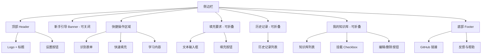

#### 3.2.2 核心功能

**快捷操作（3个按钮）：**
1. **识别表单**
   - 图标：`scan-text`
   - 功能：识别当前页面的表单结构
   - **交互方式（简化版，避免页面抖动）**：
     - 点击后显示 Toast："开始识别表单"
     - 简短延时（~800ms）后显示："识别完成，共找到 X 个字段"
     - **不添加任何视觉动画**（无扫描波纹、无输入框高亮）
     - 设置全局标记 `isFormScanned = true`
   - 目的：标记表单已识别，后续智能填充可跳过识别步骤
   
2. **快速填充**
   - 图标：`sparkles`
   - 功能：基于预设的字段映射关系快速填充
   - 映射关系说明：
     - 用户在设置页面预先配置好「字段名 → 填充内容」的映射
     - 例如："姓名" → "张三"，"邮箱" → "zhangsan@example.com"
     - AI 自动识别表单字段，匹配对应的映射关系
   - 适用场景：重复填写相同类型的表单（如注册表单、问卷调查）
   - 优势：无需 AI 生成，速度快，内容稳定
   
3. **学习内容**
   - 图标：`book-open`
   - 功能：学习当前表单已填写内容，用于快速填充和智能填充
   - 流程：
     - 抓取当前页面所有已填写的表单内容
     - 提取内容值与字段类型的映射关系
     - 示例：识别到"张明"填写在"姓名"字段 → 保存为 `张明 → ["姓名"]`
     - 保存映射关系到字段映射配置（用于快速填充）
     - AI 自动生成 Summary（不显示给用户）
     - 保存为新的知识库档案（用于智能填充）
   - 学习结果提示："已学习 X 个字段映射，并保存到知识库"

**填充要求（手风琴面板）：**
- 功能：智能填充（AI 生成内容）

**组件结构**：

1. **引用区域（Reference Area）** ⭐ 新增
   - 位置：位于文本输入框上方
   - 功能：展示被引用的内容，作为 AI 填充的上下文
   - 内容来源：
     - **知识库挂载**：用户选择的知识库档案自动显示在此
     - **页面划词**：用户在页面任意位置划词，点击"添加到引用"
   - UI 设计：
     - 引用卡片形式展示
     - 每个引用显示来源（知识库 / 页面划词）
     - 可删除按钮（X）
     - 空状态提示："暂无引用内容，可划词添加或选择知识库"
   - 示例：
     ```
     📎 引用内容 (2)
     ┌─────────────────────────────────┐
     │ 📄 来自知识库：个人档案           │
     │ 张明，5年前端开发经验...         │ [×]
     ├─────────────────────────────────┤
     │ 🔗 来自页面划词                  │
     │ "期望薪资：20-30K"              │ [×]
     └─────────────────────────────────┘
     ```

2. **填充要求输入框**
   - 多行文本输入框
   - placeholder："例如：重点突出我的技术能力，语气要专业..."
   
3. **填充按钮**
   - 主色调按钮
   - 文本："开始智能填充"

**划词功能（Selection Context Menu）**：
- 触发条件：用户在页面任意位置选中文本（`window.getSelection()`）
- 交互设计：
  - 选中文本后，出现浮动按钮："➕ 添加到引用"
  - 点击后，文本添加到引用区域
  - 记录来源信息（URL、页面标题、时间戳）
- 适用场景：
  - **BBS 回复**：引用楼层内容
  - **注册表单**：引用招聘 JD 要求
  - **问卷调查**：引用问题说明

**与快速填充的区别**：
- **智能填充**：用户可输入自定义要求 + 引用内容，AI 根据要求、引用和知识库生成内容
- **快速填充**：直接使用预设映射关系，无需 AI 生成，**自动跳过已有内容的字段**

**填充逻辑说明**：
1. **智能填充（AI 填充整个表单）**：
   - **如果表单未识别**：
     - 扫描表单（识别动画）→ 调用 AI → 流式填充所有字段
   - **如果表单已识别**（用户已点击过"识别表单"）：
     - **直接跳过识别步骤** → 调用 AI → 流式填充所有字段
   - 支持用户自定义要求
   - 使用知识库提供上下文
   - 每个字段独立打字效果
   - **状态管理**：全局变量 `isFormScanned` 标记表单是否已识别

2. **快速填充**：
   - 使用 `content → field_name_aliases` 映射关系
   - **跳过已有内容的字段**（`if (input.value && input.value.trim() !== '')`）
   - 直接填入预设值，无 AI 调用
   - 示例映射：
     ```javascript
     const mappingData = {
         0: '张明',      // 姓名
         4: 'zhangming@example.com'  // 邮箱
     };
     ```

3. **单字段 AI 填充（一键填充）**：
   - **清空字段现有内容后再填充**（`input.value = ''`）
   - 针对单个字段调用 AI
   - 支持打字效果

**识别状态管理**：
```javascript
// 全局状态
let isFormScanned = false;

// 识别表单时设置
function scanForm() {
    // ... 识别动画
    isFormScanned = true;
}

// 智能填充时判断
function fillForm() {
    if (isFormScanned) {
        startFilling(); // 直接填充
    } else {
        // 先识别，再填充
        // ... 识别动画
        isFormScanned = true;
        startFilling();
    }
}
```

**历史记录（手风琴面板）：**
- 显示最近的填充要求
- 点击可快速应用

**我的知识库（手风琴面板）：**
- 知识库列表
- 每项包含：
  - Checkbox（挂载/卸载）
  - 名称 + 描述
  - 编辑/删除按钮

#### 3.2.3 设计规范
- **卡片圆角**：12px
- **按钮圆角**：8px/10px
- **间距**：16px（卡片之间）、12px（元素之间）
- **阴影**：`var(--shadow-sm)`
- **过渡动画**：0.2s ease

---

### 3.3 设置页面（Settings）

#### 3.3.1 页面结构
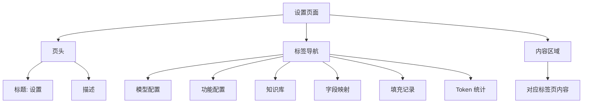

#### 3.3.2 标签页详细设计

**Tab 1: 模型配置**
- 默认模型选择
  - 模型提供商下拉框：OpenAI / 通义千问 / 智谱AI / DeepSeek / 硅基流动 / 火山引擎 / Ollama (本地)
  - 模型名称下拉框（级联）
- API Key 输入框

**Tab 2: 功能配置**
- 全局设置卡片
  - 一键应用模型到所有功能
  - 提供商 + 模型级联选择
  - 应用按钮
  
- 功能列表（每个功能独立卡片）
  - 功能名称
  - 提供商 + 模型级联选择
  - 提示词编辑（Textarea，等宽字体）
  - 重置 / 保存按钮

**功能列表：**
1. 表单填充
2. 翻译功能
3. AI 学习

**Tab 3: 知识库**
- 知识库列表
  - 每项显示：图标、名称、描述、更新时间
  - 操作按钮：编辑、删除
- 新建按钮
- 点击编辑弹出模态框
  - 档案名称
  - 档案内容（大文本框，纯文本）
  - 取消 / 保存按钮

**Tab 4: 字段映射**
- 功能说明：配置内容值与表单字段类型的映射关系，用于快速填充
- 映射列表
  - 每项显示：
    - **启用/禁用开关**（Toggle Switch）
    - 内容值（如：张明、zhangming@example.com、13800138000）
    - 字段类型（如：姓名 / Name、邮箱 / Email、手机号 / Phone）
    - 操作：编辑、删除
  - **禁用状态样式**：
    - 半透明（opacity: 0.5）
    - 文字删除线
    - 开关为灰色
  - **启用/禁用规则**：
    - 禁用的映射不会在快速填充时使用
    - 禁用≠删除，可以随时重新启用
    - 适用场景：临时不需要某个映射，但不想删除
- 新增映射按钮
- 编辑/新增弹出模态框：
  - 内容值输入框（你要填充的实际内容）
  - 字段类型输入框（支持多个别名，用 / 分隔）
  - 说明文字（映射逻辑和匹配规则）
  - 保存 / 取消按钮
- 导入/导出功能（JSON 格式）

**映射逻辑：内容 → 字段类型**
- 例如：`张明` → `姓名 / 真实姓名 / 用户名 / Name`
- 当表单中出现"姓名"、"真实姓名"、"用户名"或"Name"字段时
- 自动填充"张明"这个内容值

**匹配规则说明：**
- 字段类型支持多个别名（如："姓名 / Name"可匹配"真实姓名"、"用户姓名"、"Full Name"）
- 支持字段类型匹配（如：email、tel、url）
- 优先级：精确匹配 > 模糊匹配 > 类型匹配
- 支持中英文混合

**Tab 5: 填充记录**
- 记录列表（最大高度可滚动）
  - 网站域名 + 图标
  - 时间
  - 填充字段列表（可展开）
  - 操作：查看详情、保存为知识、删除

**Tab 6: Token 统计**
- 统计卡片（3个）
  - 今日消耗
  - 本月消耗
  - 预估费用
  
- 使用明细表格
  - 列：模型、输入/输出、消耗（带进度条）、费用
  
- 模型报价参考表格（完整59个模型）
  - 列：厂商、模型名称、输入单价、输出单价、核心定位

#### 3.3.3 响应式设计

**中等屏幕（≤768px）：**
- 表单网格改为单列
- 统计卡片改为单列
- 导航标签支持横向滚动

**窄屏（≤480px）：**
- 最小化内边距
- 缩小字体
- 表格横向滚动
- 模态框底部按钮垂直排列

---

### 3.4 输入框交互（Input Interactions）

#### 3.4.1 按钮设计原则
**纯图标 + Tooltip：**
- 所有按钮采用**纯图标设计**（无文字），适配短输入框
- 鼠标悬停显示 **Tooltip 提示**，说明按钮功能
- 按钮动态计算位置，根据输入框高度自动紧贴顶部
- 样式：`padding: 6px 8px`，圆角 `6px`，带阴影

#### 3.4.2 交互场景

**场景 1: 空输入框（无映射）**
- 点击后显示操作按钮（在输入框上方）
- 操作按钮：
  - 🪄 **一键填充**（蓝色主按钮，Tooltip: "AI 填充"）
  - 🌐 **翻译**（下拉菜单，Tooltip: "翻译"，13种语言）
  - 🔄 **重填整个表单**（Tooltip: "重填整个表单"）

**场景 2: 空输入框（有映射缓存）**
- 输入框样式：
  - 边框色：`#1f87fc`
  - Placeholder 显示缓存值（如"张明"）
  - Placeholder 颜色：`#1f87fc`
- 点击后显示所有按钮：
  - ✓ **确认按钮**（绿色，Tooltip: "填充：张明"）
  - 🪄 **一键填充**
  - 🌐 **翻译**
  - 🔄 **重填整个表单**
- 填充完成后：绿色边框 + 浅绿色背景 + 缩放动画

**场景 3: 已有内容**
- 点击后显示操作按钮：
  - 🪄 **一键填充**：清空后 AI 重新生成
  - 🌐 **翻译**：翻译现有内容
  - 🔄 **重填整个表单**

**场景 4: 多行文本框**
- 支持所有标准操作（填充、翻译、重填）
- 按钮位置根据 textarea 高度动态调整

#### 3.4.3 Tooltip 样式规范
```css
.action-btn::after,
.cache-confirm-btn::after {
    content: attr(data-tooltip);
    position: absolute;
    bottom: calc(100% + 8px);
    left: 50%;
    transform: translateX(-50%);
    background: rgba(0, 0, 0, 0.85);
    color: white;
    font-size: 11px;
    font-weight: 500;
    padding: 5px 10px;
    border-radius: 6px;
    opacity: 0;
    visibility: hidden;
    transition: all 0.2s;
    z-index: 1000;
}

.action-btn:hover::after,
.cache-confirm-btn:hover::after {
    opacity: 1;
    visibility: visible;
}

@media (prefers-color-scheme: dark) {
    .action-btn::after,
    .cache-confirm-btn::after {
        background: rgba(255, 255, 255, 0.9);
        color: #202124;
    }
}
```

#### 3.4.4 翻译语言列表（按热门度排序）
1. 🇬🇧 English
2. 🇪🇸 Español
3. 🇫🇷 Français
4. 🇩🇪 Deutsch
5. 🇵🇹 Português
6. 🇷🇺 Русский
7. 🇯🇵 日本語
8. 🇰🇷 한국어
9. 🇮🇩 Bahasa Indonesia
10. 🇹🇭 ภาษาไทย
11. 🇸🇦 العربية
12. 🇨🇳 简体中文（排在最后）
13. 🇭🇰 繁體中文（排在最后）

#### 3.4.5 操作按钮显示规则

**按钮类型**：
1. **确认按钮（绿色✓）**：仅在有缓存值时显示
2. **AI 填充按钮（蓝色✨）**：所有可编辑字段显示
3. **翻译按钮（地球🌐）**：根据字段类型判断
4. **重填表单按钮（刷新🔄）**：所有可编辑字段显示

**翻译按钮显示逻辑**：

| 字段类型 | 是否显示翻译 | 原因 |
|---------|-------------|------|
| `text` | ✅ 显示 | 文本内容可翻译 |
| `email` | ✅ 显示 | 可能包含公司名等文本 |
| `textarea` | ✅ 显示 | 长文本内容可翻译 |
| `select` | ❌ 不显示 | 下拉选项，无需翻译 |
| `number` | ❌ 不显示 | 纯数字，无需翻译 |
| `tel` | ❌ 不显示 | 电话号码，无需翻译 |
| `password` | ❌ 不显示 | 密码字段，不显示任何按钮 |
| `disabled/readonly` | ❌ 不显示 | 禁用字段，不显示任何按钮 |

**JavaScript 判断逻辑**：
```javascript
// 判断是否显示翻译按钮
function shouldShowTranslate(input) {
    const type = input.type;
    const isDisabled = input.disabled || input.readOnly;
    const isSelect = input.tagName === 'SELECT';
    
    // 密码或禁用字段：不显示任何按钮
    if (type === 'password' || isDisabled) return false;
    
    // select、number、tel：不显示翻译
    if (isSelect || type === 'number' || type === 'tel') return false;
    
    // 值为空或纯数字：不显示翻译
    const value = input.value.trim();
    if (!value || /^\d+$/.test(value)) return false;
    
    return true;
}
```

#### 3.4.6 操作按钮定位
- 位置：`bottom: calc(100% + 2px); right: 0;`
- 动态调整：根据输入框高度和边框宽度计算
- 显示控制：通过 `.mock-form-group.active` 类
- 激活条件：
  - 输入框 focus
  - 表单组 hover
  
```javascript
// 动态计算按钮位置
const inputHeight = input.offsetHeight;
const borderWidth = parseFloat(getComputedStyle(input).borderWidth) || 1.5;
actionBar.style.bottom = `calc(${inputHeight}px + ${borderWidth}px)`;
```

#### 3.4.6 Toast 系统
- 位置：顶部居中
- 动画：滑入滑出
- 显示时长：2秒
- 支持类型：success / info / error
- "学习中" 和 "快速填充" 不显示 "成功" 后缀

---

### 3.5 表单字段设计

#### 3.5.1 字段类型清单

| 序号 | 字段名 | 类型 | 特性 | 布局 |
|------|--------|------|------|------|
| 0 | 头像 | 上传占位 | 80x80，虚线框 | 单独一行 |
| 1 | 姓名 * | 文本框 | 有缓存 | 与性别同行 |
| 2 | 性别 * | 下拉框 | 男/女/其他 | 与姓名同行 |
| 3 | 学历 * | 下拉框 | 高中~博士 | 与年龄同行 |
| 4 | 年龄 * | 数字框（短） | 短输入框 | 与学历同行 |
| 5 | 邮箱 * | Email | 有缓存 | 与手机同行 |
| 6 | 手机号 * | Tel | 标准宽度 | 与邮箱同行 |
| 7 | 地址 | 文本框 | 标准宽度 | 单独一行 |
| 8 | 公司名称 | 文本框 | 标准宽度 | 单独一行 |
| 9 | 个人简介 * | 多行文本 | min-height: 120px | 单独一行 |
| 10 | 用户ID | 文本框 | 禁用，只读 | 单独一行 |
| 11 | 完成度 | 进度条 | 非交互 | 单独一行 |

#### 3.5.2 双列布局规则
```css
.mock-form-row {
    display: grid;
    grid-template-columns: 1fr 1fr;
    gap: 16px;
}

@media (max-width: 768px) {
    .mock-form-row {
        grid-template-columns: 1fr;
    }
}
```

**布局安排：**
- **行1（头像）**：单独占一行
- **行2（姓名+性别）**：`grid-template-columns: 1fr 1fr`
- **行3（学历+年龄）**：`grid-template-columns: 1fr 1fr`
- **行4（邮箱+手机）**：`grid-template-columns: 1fr 1fr`
- **行5（地址）**：单独占一行
- **行6（公司）**：单独占一行
- **行7（简介）**：单独占一行
- **行8（用户ID）**：单独占一行
- **行9（进度条）**：单独占一行

#### 3.5.3 头像上传样式
```css
.mock-avatar-placeholder {
    width: 80px;
    height: 80px;
    border: 2px dashed var(--border);
    border-radius: 8px;
    display: flex;
    flex-direction: column;
    align-items: center;
    justify-content: center;
    cursor: pointer;
    transition: all 0.2s;
    background: var(--bg-secondary);
}

.mock-avatar-placeholder:hover {
    border-color: var(--primary);
    background: var(--bg-hover);
}
```

---

## 四、交互流程

### 4.1 首次使用流程
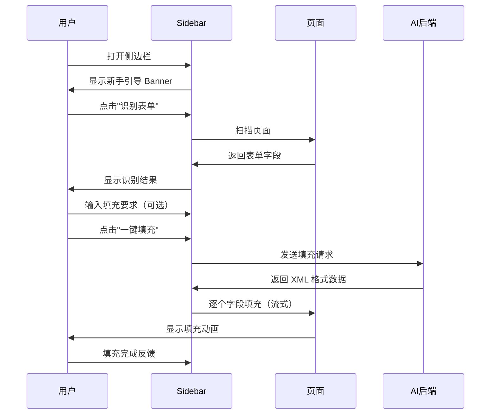

### 4.2 有缓存值填充流程
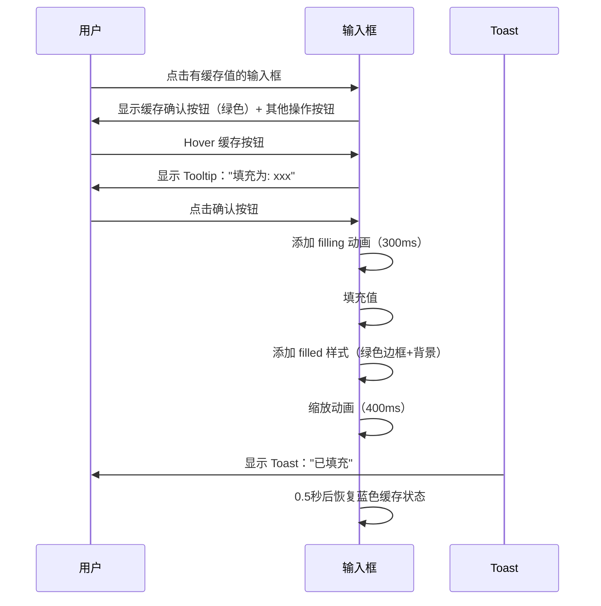

### 4.3 快速填充流程（基于字段映射）
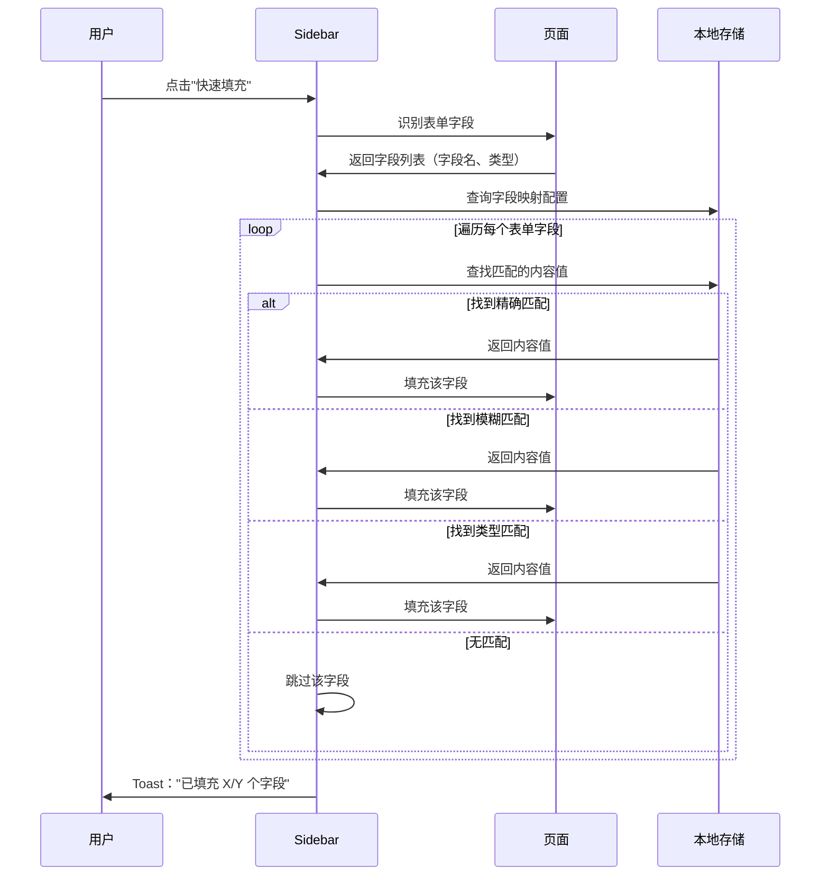

**映射示例：**
```javascript
{
  "张明": ["姓名", "真实姓名", "用户名", "Name", "Full Name"],
  "zhangming@example.com": ["邮箱", "Email", "电子邮件", "E-mail"],
  "13800138000": ["手机号", "电话", "联系方式", "Phone", "Mobile"],
  "金山办公": ["公司", "单位", "工作单位", "Company"]
}
```

**匹配逻辑：**
1. 表单字段：`<input placeholder="请输入您的姓名">`
2. AI 识别：字段类型为"姓名"
3. 查询映射：找到"张明" → ["姓名", ...]
4. 自动填充："张明"

### 4.4 智能填充流程（AI 生成）
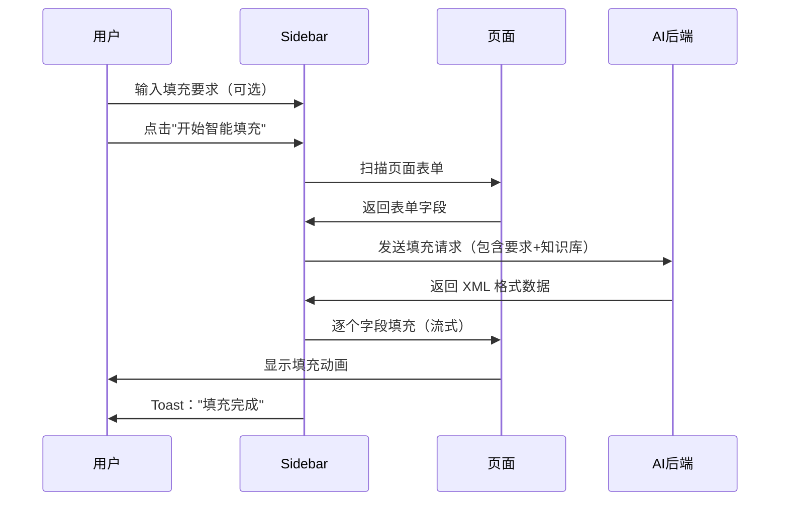

### 4.5 字段映射管理流程
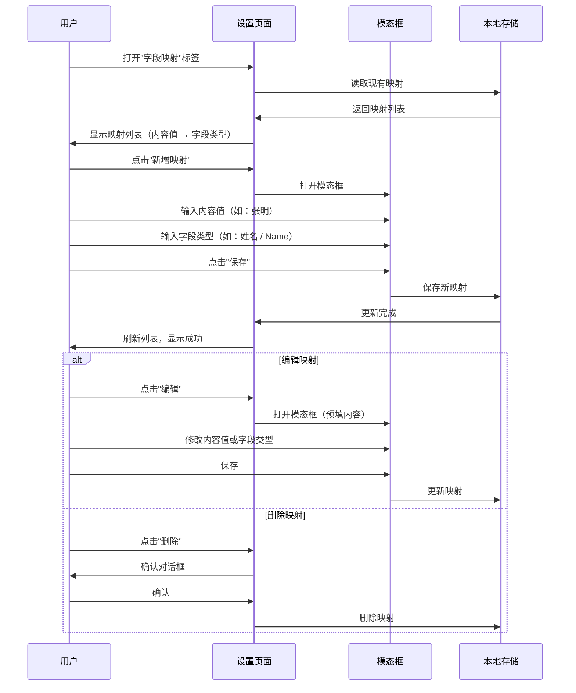

**数据结构示例：**
```json
{
  "mappings": [
    {
      "id": "map_001",
      "contentValue": "张明",
      "fieldTypes": ["姓名", "真实姓名", "用户名", "Name", "Full Name"],
      "createdAt": "2025-01-31"
    },
    {
      "id": "map_002",
      "contentValue": "zhangming@example.com",
      "fieldTypes": ["邮箱", "Email", "电子邮件", "E-mail"],
      "createdAt": "2025-01-31"
    }
  ]
}
```

### 4.6 已有内容填充流程
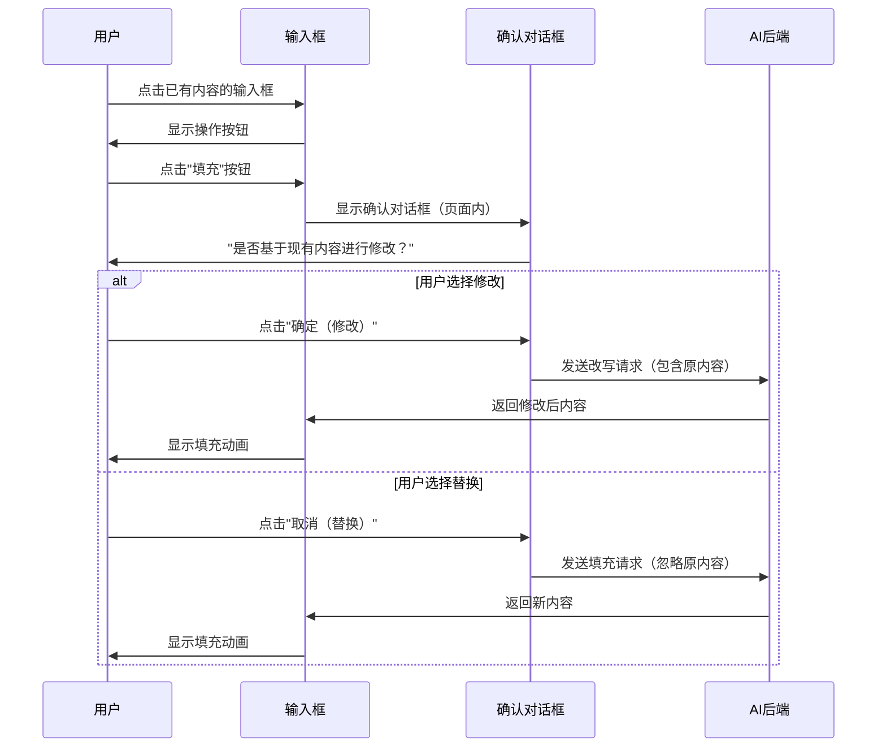

### 4.7 学习内容流程
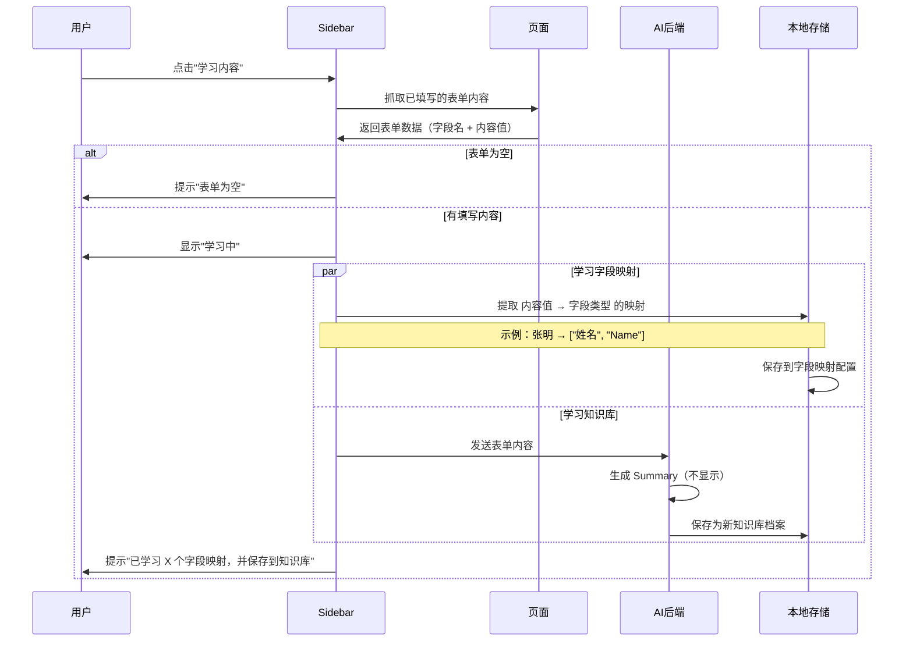

**学习内容的双重作用：**

1. **字段映射**（内容 → 字段类型）：用于快速填充
   - 提取逻辑：
     - 字段：`<input name="realName" placeholder="姓名">`，内容：`张明`
     - 保存映射：`张明` → `["姓名", "realName"]`
   - 保存位置：字段映射配置
   - 使用场景：快速填充相同类型的表单
   - 示例：
     ```javascript
     {
       "张明": ["姓名", "真实姓名", "Name"],
       "zhangming@example.com": ["邮箱", "Email"],
       "13800138000": ["手机号", "电话", "Phone"]
     }
     ```

2. **知识库**：用于智能填充
   - 示例：完整的个人信息、工作经历等
   - 保存位置：知识库档案
   - 使用场景：AI 根据要求生成个性化内容

### 4.8 知识库管理流程
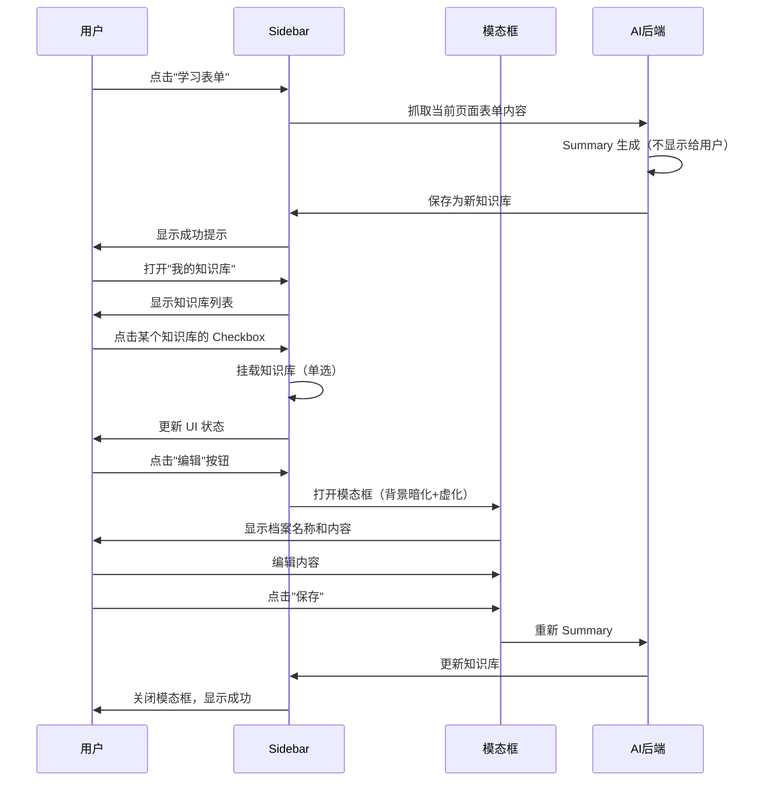

### 4.9 智能填充决策流程（基于知识库）
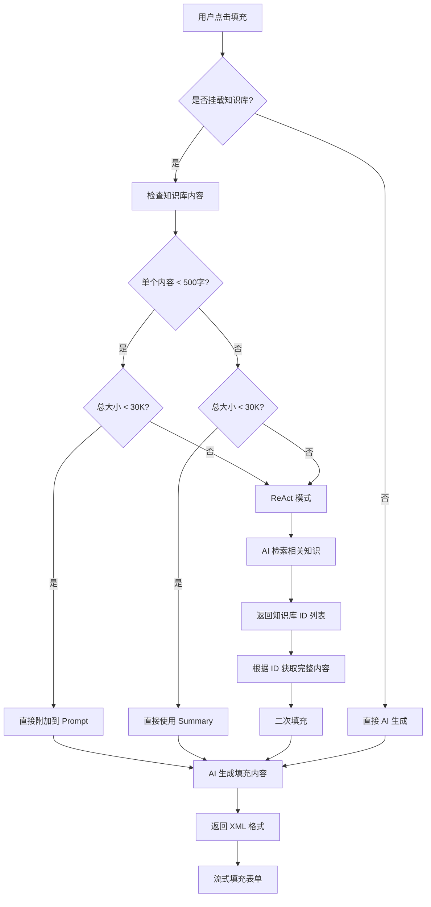

**决策规则详解：**

1. **直接附加模式（< 500字 且 总计 < 30K）**
   ```javascript
   if (knowledgeItem.content.length < 500 && totalSize < 30000) {
       // 直接将知识库内容添加到 Prompt
       prompt += `\n\n参考信息：\n${knowledgeItem.content}`;
   }
   ```
   - **优点**：简单高效，一次性完成
   - **适用场景**：知识库内容简短，不会超出 token 限制

2. **Summary 模式（内容 ≥ 500字 但 总计 < 30K）**
   ```javascript
   if (knowledgeItem.content.length >= 500 && totalSize < 30000) {
       // 使用预生成的 Summary
       prompt += `\n\n参考信息摘要：\n${knowledgeItem.summary}`;
   }
   ```
   - **优点**：压缩内容，节省 token
   - **适用场景**：知识库内容较长但未超限

3. **ReAct 模式（总计 ≥ 30K）**
   ```javascript
   if (totalSize >= 30000) {
       // 第一步：AI 检索
       const relevantIds = await ai.retrieveRelevant({
           query: userPrompt,
           knowledgeBase: summaryList
       });
       
       // 第二步：获取完整内容
       const fullContent = relevantIds.map(id => 
           getKnowledgeById(id)
       );
       
       // 第三步：二次填充
       const result = await ai.fill({
           prompt: userPrompt,
           context: fullContent
       });
   }
   ```
   - **流程**：
     1. AI 接收所有 Summary 列表
     2. AI 返回相关知识库 ID 数组
     3. 系统根据 ID 获取完整内容
     4. AI 基于完整内容生成填充结果
   - **优点**：智能筛选，避免 token 溢出
   - **适用场景**：知识库内容很多或很长

---

## 五、技术实现细节

### 5.1 暗黑模式实现
```css
/* 自动检测系统暗黑模式 */
@media (prefers-color-scheme: dark) {
    :root {
        --primary: #4d9fff;
        --text-primary: #e8eaed;
        --text-secondary: #9aa0a6;
        --text-tertiary: #80868b;
        --border: #3c4043;
        --bg-primary: #202124;
        --bg-secondary: #292a2d;
        --bg-hover: #35363a;
        --success: #35a557;
    }
}
```

### 5.2 手风琴动画实现
```css
.collapsible-content {
    max-height: 0;
    overflow: hidden;
    padding: 0 16px;
    opacity: 0;
    transition: max-height 0.3s ease, 
                padding 0.3s ease, 
                opacity 0.3s ease;
}

.collapsible-content.active {
    max-height: 800px;
    padding: 16px;
    opacity: 1;
}
```

### 5.3 输入框激活控制
```javascript
// 监听 focus 事件
input.addEventListener('focus', function() {
    const wrapper = this.closest('.input-wrapper');
    wrapper.classList.add('active');
    
    // 如果有缓存，显示缓存按钮
    if (this.classList.contains('has-cache')) {
        const cacheBtn = wrapper.querySelector('.cache-confirm-btn');
        cacheBtn.style.display = 'flex';
    }
});

// 监听 blur 事件（延迟取消激活）
input.addEventListener('blur', function() {
    const wrapper = this.closest('.input-wrapper');
    setTimeout(() => {
        if (!wrapper.matches(':hover') && 
            !wrapper.querySelector('.confirm-dialog.active')) {
            wrapper.classList.remove('active');
        }
    }, 200);
});
```

### 5.4 Toast 实现
```javascript
function showToast(message, type = 'success') {
    const toast = document.getElementById('toast');
    const messageEl = document.getElementById('toast-message');
    
    messageEl.textContent = message;
    toast.className = 'toast ' + type;
    
    setTimeout(() => {
        toast.classList.add('show');
    }, 10);
    
    setTimeout(() => {
        toast.classList.remove('show');
    }, 2000);
}
```

---

## 六、多语言支持

### 6.1 Demo 数据多语言化

为了更好地测试翻译功能，所有 Demo 数据支持 13 种语言：

```javascript
const demoData = {
    '姓名': {
        'zh-CN': '张明',
        'zh-HK': '張明',
        'en': 'Zhang Ming',
        'ja': '張明',
        'ko': '장명',
        'ru': 'Чжань Минь',
        'es': 'Zhang Ming',
        'pt': 'Zhang Ming',
        'fr': 'Zhang Ming',
        'de': 'Zhang Ming',
        'id': 'Zhang Ming',
        'th': 'จาง หมิง',
        'ar': 'تشانغ مينغ'
    },
    '地址': {
        'zh-CN': '广东省横琴粤澳深度合作区',
        'zh-HK': '廣東省珠海市橫琴新區',
        'en': 'Hengqin New Area, Zhuhai, Guangdong',
        'ja': '広東省珠海市横琴新区',
        // ... 其他语言
    }
    // ... 其他字段
};
```

### 6.2 支持的语言列表

按照热门程度排序（与翻译下拉菜单一致）：

1. 🇬🇧 English
2. 🇪🇸 Español
3. 🇫🇷 Français
4. 🇩🇪 Deutsch
5. 🇵🇹 Português
6. 🇷🇺 Русский
7. 🇯🇵 日本語
8. 🇰🇷 한국어
9. 🇮🇩 Bahasa Indonesia
10. 🇹🇭 ภาษาไทย
11. 🇸🇦 العربية
12. 🇨🇳 简体中文
13. 🇭🇰 繁體中文

---

## 七、核心算法与逻辑

### 6.1 快速填充算法（基于字段映射）

#### 6.1.1 映射数据结构
```javascript
{
  mappings: [
    {
      id: "map_001",
      contentValue: "张明",                    // 要填充的内容
      fieldTypes: [                           // 可匹配的字段类型
        "姓名", "真实姓名", "用户名",          // 中文别名
        "Name", "Full Name", "Username"       // 英文别名
      ],
      createdAt: "2025-01-31",
      updatedAt: "2025-01-31"
    },
    {
      id: "map_002",
      contentValue: "zhangming@example.com",
      fieldTypes: ["邮箱", "Email", "电子邮件", "E-mail"],
      createdAt: "2025-01-31"
    }
  ]
}
```

#### 6.1.2 快速填充算法伪代码
```javascript
async function quickFillForm(formFields) {
    // 1. 获取所有映射配置
    const mappings = await loadMappings();
    
    // 2. 识别表单字段
    const results = [];
    let filledCount = 0;
    let skippedCount = 0;
    
    for (const field of formFields) {
        // 检查字段是否已有内容
        if (field.value && field.value.trim() !== '') {
            skippedCount++;
            continue; // 跳过已有内容的字段
        }
        
        const fieldName = field.name || field.placeholder || field.label;
        const fieldType = field.type; // email, tel, url 等
        
        // 3. 查找匹配的映射
        const match = findBestMatch(fieldName, fieldType, mappings);
        
        if (match) {
            results.push({
                field: field,
                value: match.contentValue,
                matchType: match.type // 'exact' | 'fuzzy' | 'type'
            });
            filledCount++;
        }
    }
    
    // 4. 填充字段
    for (const result of results) {
        await fillField(result.field, result.value);
    }
    
    // 5. 返回填充结果
    return {
        total: formFields.length,
        filled: filledCount,
        skipped: skippedCount,
        unfilled: formFields.length - filledCount - skippedCount
    };
}

// 查找最佳匹配
function findBestMatch(fieldName, fieldType, mappings) {
    let bestMatch = null;
    let bestScore = 0;
    
    for (const mapping of mappings) {
        for (const type of mapping.fieldTypes) {
            // 精确匹配（优先级最高）
            if (fieldName === type) {
                return { ...mapping, type: 'exact', score: 100 };
            }
            
            // 模糊匹配（包含关系）
            if (fieldName.includes(type) || type.includes(fieldName)) {
                const score = 80;
                if (score > bestScore) {
                    bestScore = score;
                    bestMatch = { ...mapping, type: 'fuzzy', score };
                }
            }
        }
        
        // 类型匹配（如 email、tel）
        if (fieldType && mapping.fieldTypes.some(t => 
            t.toLowerCase() === fieldType.toLowerCase()
        )) {
            const score = 60;
            if (score > bestScore) {
                bestScore = score;
                bestMatch = { ...mapping, type: 'type', score };
            }
        }
    }
    
    return bestMatch;
}
```

#### 6.1.3 匹配示例

**示例 1：精确匹配**
- 表单字段：`<input placeholder="姓名">`
- 映射配置：`张明` → `["姓名", "Name"]`
- 匹配结果：精确匹配"姓名" → 填充"张明"

**示例 2：模糊匹配**
- 表单字段：`<input placeholder="请输入您的真实姓名">`
- 映射配置：`张明` → `["姓名", "真实姓名", "Name"]`
- 匹配结果：模糊匹配"真实姓名" → 填充"张明"

**示例 3：类型匹配**
- 表单字段：`<input type="email" placeholder="请输入邮箱">`
- 映射配置：`zhangming@example.com` → `["邮箱", "Email"]`
- 匹配结果：类型匹配（email + "Email"） → 填充"zhangming@example.com"

**示例 4：中英文混合**
- 表单字段：`<input placeholder="Company Name">`
- 映射配置：`金山办公` → `["公司", "Company", "单位"]`
- 匹配结果：模糊匹配"Company" → 填充"金山办公"

#### 6.1.4 跳过已有内容的逻辑

**核心原则：** 快速填充不覆盖用户已填写的内容

```javascript
// 检查字段是否已有内容
if (field.value && field.value.trim() !== '') {
    skippedCount++;
    continue; // 跳过该字段
}
```

**填充结果提示：**
- 全部已填写：`"所有字段已填写，无需填充"`
- 部分跳过：`"已填充 X 个字段，跳过 Y 个已有内容"`
- 全部填充：`"填充完成"`

**示例场景：**
```
表单字段：6个
已填写：2个（姓名、邮箱）
映射匹配：4个（姓名、邮箱、手机号、公司）

执行结果：
- 跳过：姓名、邮箱（已有内容）
- 填充：手机号、公司
- 提示："已填充 2 个字段，跳过 2 个已有内容"
```

### 6.2 智能填充决策算法（基于知识库）

#### 6.2.1 知识库数据结构
```javascript
{
  id: "kb_001",
  name: "个人简历",
  content: "原始文本内容...",  // 用户编辑的完整内容
  summary: "AI 生成的摘要...", // 自动生成，不显示给用户
  contentLength: 1250,         // 字符数
  createdAt: "2025-01-31",
  updatedAt: "2025-01-31",
  mounted: true                // 是否挂载
}
```

#### 6.2.2 填充决策伪代码
```javascript
async function intelligentFill(userPrompt, formFields) {
    // 1. 获取挂载的知识库
    const mountedKB = getKnowledgeBases().filter(kb => kb.mounted);
    
    if (mountedKB.length === 0) {
        // 无知识库，直接 AI 生成
        return await ai.fill({ prompt: userPrompt, fields: formFields });
    }
    
    // 2. 计算总大小
    let totalSize = 0;
    let smallContents = [];
    let summaryList = [];
    
    for (const kb of mountedKB) {
        totalSize += kb.content.length;
        
        if (kb.contentLength < 500) {
            smallContents.push(kb);
        }
        
        summaryList.push({
            id: kb.id,
            name: kb.name,
            summary: kb.summary
        });
    }
    
    // 3. 决策逻辑
    if (totalSize < 30000) {
        // 3.1 直接附加模式
        let contextPrompt = userPrompt;
        
        for (const kb of smallContents) {
            contextPrompt += `\n\n## ${kb.name}\n${kb.content}`;
        }
        
        for (const kb of mountedKB) {
            if (!smallContents.includes(kb)) {
                contextPrompt += `\n\n## ${kb.name} (摘要)\n${kb.summary}`;
            }
        }
        
        return await ai.fill({
            prompt: contextPrompt,
            fields: formFields
        });
    } else {
        // 3.2 ReAct 模式（两阶段填充）
        
        // 第一阶段：检索相关知识
        const retrievalPrompt = `
用户需求：${userPrompt}
表单字段：${JSON.stringify(formFields)}
可用知识库摘要：${JSON.stringify(summaryList)}

请返回最相关的知识库 ID 列表（JSON 数组格式）：
        `;
        
        const relevantIds = await ai.retrieve(retrievalPrompt);
        // 返回示例：["kb_001", "kb_003"]
        
        // 第二阶段：基于完整内容填充
        let fullContext = userPrompt;
        for (const id of relevantIds) {
            const kb = mountedKB.find(k => k.id === id);
            if (kb) {
                fullContext += `\n\n## ${kb.name}\n${kb.content}`;
            }
        }
        
        return await ai.fill({
            prompt: fullContext,
            fields: formFields
        });
    }
}
```

#### 6.2.3 阈值说明
- **500 字**：单个知识库内容长度阈值
  - 小于 500 字认为是"简短内容"，可以直接附加
  - 大于等于 500 字使用 Summary
  
- **30K 字符**：总内容长度阈值
  - 约 30,000 tokens（按中文 1 字 ≈ 1 token 估算）
  - 超过此阈值需要使用 ReAct 模式避免溢出
  - 预留一定 buffer 给 AI 响应和系统 prompt

#### 6.2.4 优化策略
1. **缓存 Summary**
   - Summary 在保存时生成，不在填充时生成
   - 减少填充延迟
   
2. **批量检索**
   - ReAct 模式第一阶段一次性返回所有相关 ID
   - 避免多次往返
   
3. **渐进式加载**
   - 优先使用小内容
   - 大内容优先使用 Summary
   - 最后才使用 ReAct

---

## 七、测试用例

### 7.1 动效测试
| 测试项 | 输入 | 预期输出 |
|--------|------|----------|
| 扫描动效 | 点击"扫描动效"按钮 | 输入框显示黄色脉冲动画1.5秒 |
| 填充动效 | 点击"填充动效"按钮 | 输入框显示渐变边框动画0.8秒 |
| 成功动效 | 点击"成功动效"按钮 | 输入框显示绿色边框+缩放动画0.5秒 |
| 错误动效 | 点击"错误动效"按钮 | 输入框显示红色边框+抖动动画0.5秒 |

### 7.2 交互测试
| 测试项 | 操作 | 预期结果 |
|--------|------|----------|
| 空输入框激活 | 点击空输入框 | 显示操作按钮，位置在输入框上方4px |
| 有缓存值点击 | 点击有缓存值输入框 | 显示绿色确认按钮和其他操作按钮 |
| 缓存值填充 | 点击确认按钮 | 执行填充动画，显示Toast，0.5秒后恢复蓝色 |
| 已有内容填充 | 点击已有内容输入框的填充按钮 | 弹出页面内确认对话框 |
| 手风琴折叠 | 点击折叠面板标题 | 平滑展开/收起，带透明度和高度动画 |

### 7.3 响应式测试
| 屏幕宽度 | 布局变化 |
|----------|----------|
| ≥769px | 正常桌面布局 |
| ≤768px | 表单单列，导航横向滚动 |
| ≤480px | 最小化间距，表格横向滚动，模态框全宽 |

### 7.4 暗黑模式测试
| 测试项 | 浅色模式 | 暗色模式 |
|--------|----------|----------|
| 主色调 | `#1f87fc` | `#4d9fff` |
| 成功色 | `#2d8f47` | `#35a557` |
| 背景色 | `#ffffff` | `#202124` |
| 文本色 | `#202124` | `#e8eaed` |
| 有缓存背景 | `rgba(31,135,252,0.08)` | `rgba(77,159,255,0.15)` |

### 7.5 智能填充决策测试

| 场景 | 知识库配置 | 预期行为 |
|------|------------|----------|
| 无知识库 | 未挂载任何知识库 | 直接 AI 生成，不使用知识库 |
| 简短内容 | 2个知识库，各300字，总600字 | 直接附加两个完整内容到 Prompt |
| 混合内容 | 1个200字 + 1个800字，总1000字 | 200字完整附加，800字使用 Summary |
| 总量临界 | 多个知识库，总计29K字 | 小内容完整附加，大内容用 Summary |
| 超出限制 | 5个知识库，总计50K字 | ReAct 模式：先检索相关ID，再二次填充 |
| ReAct 筛选 | 总50K，用户需求只涉及2个 | AI 返回2个相关ID，仅用这2个完整内容 |

---

## 八、待实现功能

### 8.1 Phase 1（已完成）
- ✅ 动效 Playground 页面
- ✅ 输入框状态动效（scanning/filling/filled/error）
- ✅ 气泡提示动效
- ✅ Sidebar 界面重构
- ✅ 设置页面重构
- ✅ 输入框交互（空/缓存/已有内容）
- ✅ 暗黑模式支持
- ✅ 响应式布局

### 8.2 Phase 2（待开发）
- ⏳ 表单识别功能实现
- ⏳ AI 填充 API 集成
- ⏳ 知识库本地存储
  - ⏳ 知识库内容存储（纯文本）
  - ⏳ Summary 自动生成和缓存
  - ⏳ 智能填充决策引擎（< 500字 / Summary / ReAct）
- ⏳ Token 统计功能
- ⏳ 填充记录持久化
- ⏳ 导出/导入知识库

### 8.3 Phase 3（规划中）
- 📋 多语言支持
- 📋 自定义快捷键
- 📋 知识库同步（云端）
- 📋 团队协作功能

---

## 九、文件结构

```
playground/
├── index.html                          # Playground 导航页
├── animation-playground.html           # 动效演示页（参考）
├── v2-sidebar-redesign.html           # 侧边栏 V3 设计
├── v2-settings-redesign.html          # 设置页 V3 设计
├── v2-input-interactions-redesign.html # 输入框交互 V3 设计
├── v2-sidebar.html                     # 侧边栏 V2 旧版（保留参考）
├── v2-settings.html                    # 设置页 V2 旧版（保留参考）
├── v2-input-interactions.html          # 输入框交互 V2 旧版（保留参考）
└── PRD.md                              # 本文档
```

**Playground 页面列表**：

1. **index.html** - 导航页
   - 所有 Playground 页面的入口

2. **v2-sidebar-redesign.html** - 侧边栏 + 注册表单场景
   - 完整的侧边栏交互
   - 模拟注册表单填充

3. **v2-bbs-reply.html** - BBS 回复场景 ⭐ 新增
   - 模拟论坛帖子页面
   - 主楼 + 多个回复楼层
   - 支持划词添加到引用
   - 回复框支持 AI 填充
   - 引用区域完整交互

4. **v2-settings-redesign.html** - 设置页面
   - 模型配置、知识库管理、字段映射等

5. **v2-input-interactions-redesign.html** - 输入框交互动效
   - 所有输入框状态演示

---

## 十、更新日志

### 2025-01-31
- 创建 PRD.md
- 完成 V3 Redesign 所有页面
- 修复按钮位置、层级、配色等问题
- 优化窄屏响应式布局
- 添加手风琴平滑动画
- 优化快捷操作按钮 hover 效果
- 完善有缓存值填充完成状态
- **新增第六章：核心算法与逻辑**
  - 智能填充决策算法
  - 知识库数据结构
  - 三种填充模式（直接附加/Summary/ReAct）
  - 阈值说明（500字/30K）
  - 完整伪代码实现
- 新增智能填充决策测试用例
- **集成 Lucide Icons**
  - 下载本地文件（lucide.min.js）
  - 替换所有 46 个 SVG 图标
  - 优化图标大小（主按钮 16px，GitHub 14px）
  - 更新图标：`scan-text`、`list-restart`、`languages`
- **优化识别表单逻辑**
  - 移除视觉动画，改用 Toast 提示
  - 添加 `isFormScanned` 状态管理
  - 智能填充时跳过重复识别（节省 ~3秒）
- **新增引用区域功能**
  - 填充要求面板中添加引用区域
  - 支持知识库挂载显示
  - 支持页面划词添加引用
  - 引用卡片可删除
- **新增应用场景章节**
  - 场景一：注册表单填充
  - 场景二：BBS 论坛回复（⭐ 重点）
  - 规划更多场景
- **规划 BBS 回复 Playground**
  - v2-bbs-reply.html（待实现）
  - 模拟论坛帖子页面
  - 完整划词引用交互

---

## 十一、联系方式

- **开发者**：洛小山
- **GitHub**：https://github.com/itshen/
- **开源协议**：MIT License
- **版权信息**：Copyright (c) 2025 Miyang Tech (Zhuhai Hengqin) Co., Ltd.
